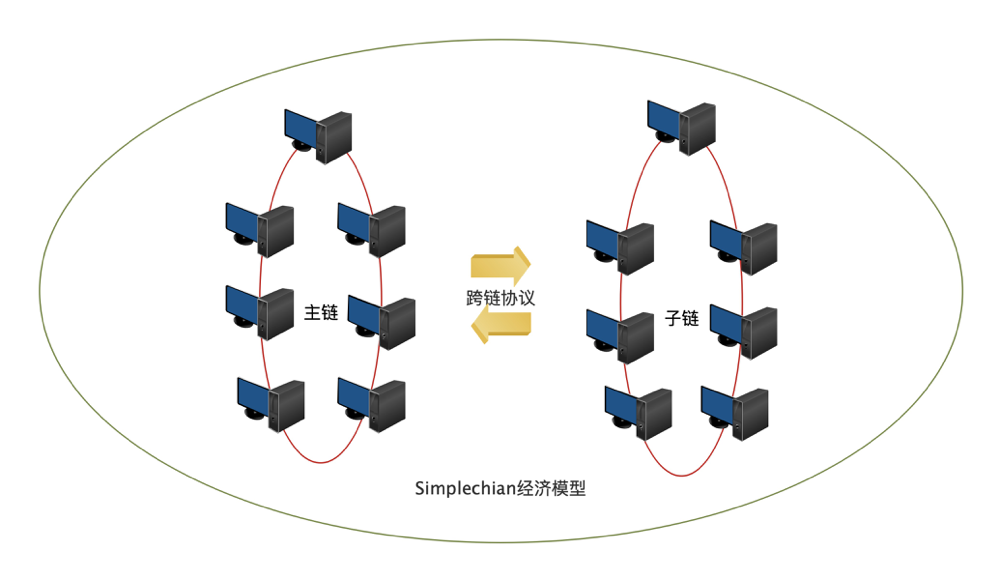

The following figure shows the overall architecture of Simplechain:

## Top-level architecture design

The blockchain can be simply divided into three layers: protocol layer, extension layer, and application layer. The protocol layer can be divided into storage layer and network layer, which are independent but inseparable.

The top layer of Simplechain is DApp, which is the display layer of the entire blockchain. It exchanges with the intelligent contract layer through Web3.js. For example, Simplechain uses web3-js, the application layer of a blockchain can be a mobile terminal, a web terminal, or an existing server that is integrated into the application layer.

All smart contracts run on EVM (virtual machines) and use RPC(Remote Procedure Call Protocol, which is A process method called by B through the network).

Under EVM and RPC, there are four core contents of Simplechain, including blockChain, consensus algorithm, mining, and network layer. All parts except DApp are in the client sipe of Simplechain.

## From the perspective of data structure

The protocol layer is the underlying technology. This layer is usually a complete blockchain product, similar to the operating system of our computer. It maintains network nodes and only provides APIs for calling. Network programming, distributed algorithm, encryption signature, data storage technology and other four aspects, distributed algorithm is basically a business logic implementation, can be achieved in any language, the encrypted signature technology is used directly and simply, and the database technology is also mainly used at the use level.
 
`Storage layer:`A Block + Lian Biao and blockchain data structure. The database used in Simplechain is levelDB.

`Network layer:`p2p network, the implementation of P2P network and concurrent processing are the difficulties in development, so for those languages with strong network programming ability and simple concurrent processing, block chain applications in Nodejs Development Zone, gradually becoming more and more popular, Go language began to be very popular.

`Consensus layer:`That is, the incentive layer, through the mining mechanism, formulates the way of obtaining currency through the blockchain. For example, Bitcoin uses POW(Proof of Work workload): The better the performance of a computer, the easier it is to obtain monetary rewards. And POS(Proof of Stake equity certification mechanism): similar to the concept of crowdfunding dividends, it will pay interest to holders according to the amount and time of currency you hold.

`Extension layer:`Similar to computer drivers, this part of Simplechain includes EVM (virtual machine) and intelligent contract. To make blockchain products more practical, such as Simplechain's "smart contract" concept, which is a typical application development at the expansion level.

`Contract layer:`Previous blockchains did not have this layer. Therefore, the original blockchain can only conduct transactions, but cannot be used in other fields or other logical processing. But the emergence of contract layer and intelligent contract is "programmable contract", or "contract intelligence", in which "intelligence" is the intelligence of execution, that is to say, to reach a certain condition, the automatic execution of contracts makes the use of blockchains in other fields a reality.

`Application layer:`Similar to various software programs in a computer, the display layer of the blockchain. DAPP is also an application at this level. It publishes smart contracts to the blockchain. People access this block through addresses and then interact with smart contracts. Simplechain uses web3-js. The application layer of a blockchain can be a mobile terminal, a web terminal, or an existing server that is integrated into the application layer. The DAPP developed based on this actually encapsulates a layer of Web applications on the basis of intelligent contracts. The issue of tokens and so on are all at this level, and interact with intelligent contracts through Web applications provided by DAPP.

## Aggregate chain architecture

SimpleChain designs an aggregate chain structure of a main chain and multiple sub-chains, which supports blockchain deployment and expansion in various business scenarios. The SimpleChain main chain adopts the mature PoW mechanism, while the sub-chain can set consensus algorithms suitable for its own scenarios according to business requirements, and form a two-way anchoring method with the main chain through atomic exchange or cross-chain nodes, cross-chain transactions with other sub-chains. This main chain mechanism can help the sub-chain obtain the final consistency guarantee provided by the SimpleChain main chain on the premise of meeting thousands of levels of performance per second.

																						
The Simplechain sub-chain can be either a public chain or a consortium chain. Its chain structure is similar to that of the main chain (see blockchain architecture design). However, due to different business requirements, different consensus algorithms can be used to achieve thousands of TPS performance, or other custom development functions.

The main chain and sub-chain achieve mutual anchoring, information exchange and capital flow through cross-chain protocols. The cross-chain protocol (see cross-chain protocol) adopts the free notary mechanism. All users in the whole network ecosystem can participate in and supervise it. The community's self-care ability can be effectively utilized to effectively ensure the reliability of cross-chain information, the transaction is safe and orderly. At the same time, Simplechain Foundation has carried out the research on the economic model of the main chain and established a set of incentive mechanism for the sustainable and healthy development of Simplechain ecosystem. Under the effect of this mechanism, the main chain ecosystem will integrate and promote each other, common development.

!

