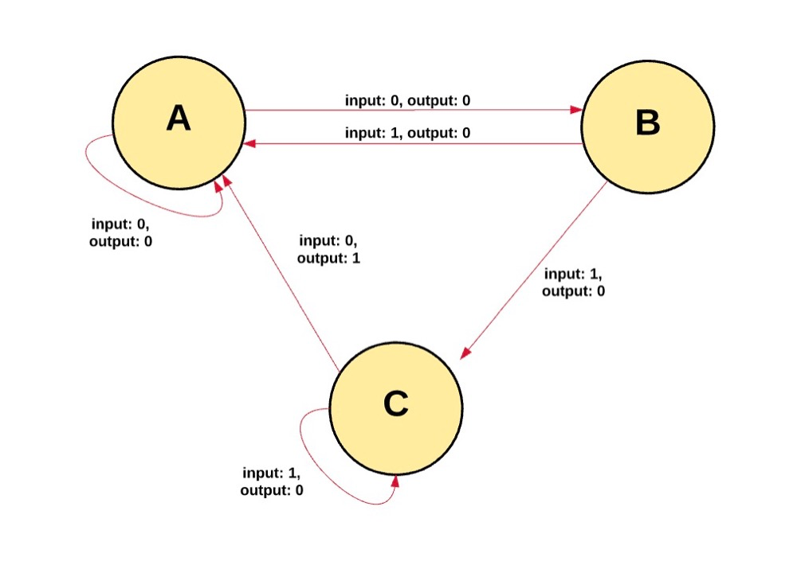

## Simplechain model description
 
Simplechain is essentially a transaction-based state machine. In computer science, a state machine refers to something that can read a series of inputs and then convert them into a new state.

According to Simplechain's state machine, we start with genesis state. There is no transaction generation status in the network. When the transaction is executed, the Genesis state will turn into the final state. At any time, this final state represents the current state of Simplechain.

Simplechain has millions of transactions in the state. These transactions are "grouped" into a block. A block contains a series of transactions, and each block is linked to its previous block.

In order to convert a state to the next state, the transaction must be valid. In order to make a transaction considered effective, it must go through a verification process, which is mining. Mining is a group of nodes (computers) that use their computing resources to create a block containing valid transactions.

To add a block to the main chain, a miner must provide this "proof" faster than other miners ". The process of verifying each block through a "proof" of mathematical mechanism provided by miners is called proof of work.

It is proved that miners in a new area will be rewarded with a certain value. What is the reward? Simplechain uses an internal digital token-SIMPLE as a reward. Every time a miner proves a new block, a new SIMPLE will be generated and rewarded to the miner.

Whenever multiple paths are generated, a "fork" will appear. We usually want to avoid forking, because they will destroy the system and force people to choose which chain they believe.

In order to determine which path is the most effective and prevent the generation of multiple chains, Simplechain uses a mathematical mechanism called "GHOST protocol.。

    GHOST = Greedy Heaviest Observed Subtree

In short, the GHOST Protocol allows us to select a path on which the most calculations are completed. One way to determine the path is to use the block number of the nearest block (leaf block). The block number represents the total number of blocks on the current path (excluding Genesis blocks). The larger the block number is, the longer the path is, indicating that more mining computing power is consumed on this path to reach the leaf block. Using this reasoning can allow us to agree with the authoritative version of the current state.

