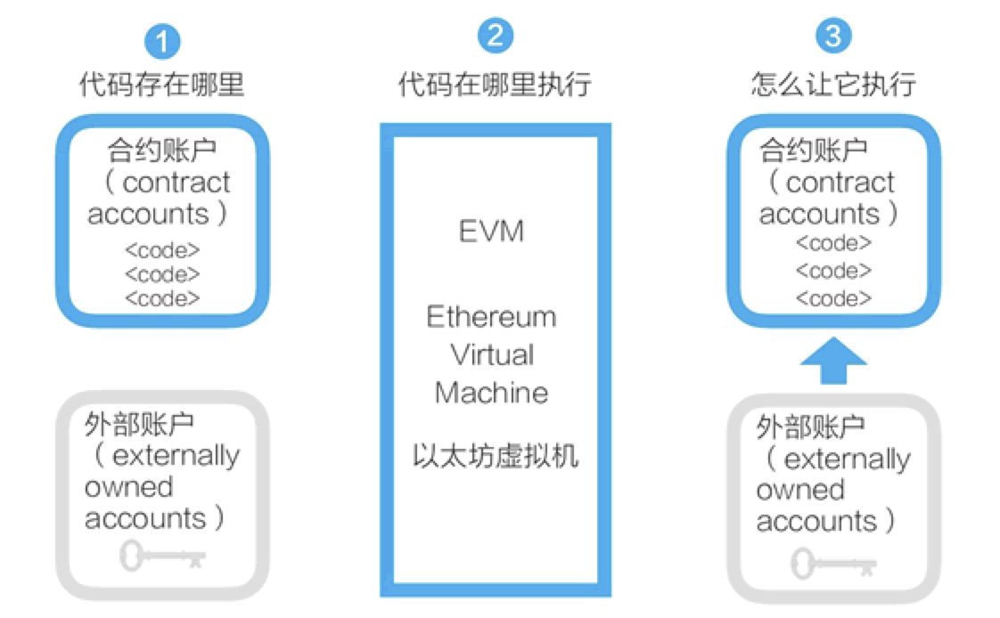

Simplechain's smart contract is not a common contract in reality, but a piece of program code that exists on the blockchain and can be triggered to execute. These codes implement some predetermined rules, is an "autonomous proxy" that exists in the Simplechain execution environment ". Simplechain's account and contract are shown in Figure 1.

**The intelligent contract design of Simplechain is concise**

- Anyone can develop smart contracts on the Simplechain Blockchain. The code of these smart contracts exists in the account of Simplechain, and the account with code is called the contract account. Correspondingly, an account controlled by a key can be called an external account.
- The smart contract program of Simplechain runs on the Simplechain virtual machine.
- The contract account cannot start and run its own smart contract. To run a smart contract, an external account needs to initiate a transaction with the contract account to start the execution of the code in it.

A major difference between Simplechain and bitcoin is that Simplechain provides Turing's complete programming language (Solidity) and the corresponding operating environment (EVM). The so-called Turing completeness means that this scripting programming language can run all possible calculations, while bitcoin UTXO models and scripts can only run partial calculations.

The most popular intelligent contract language in Simplechain is Solidity, which is similar to classes in object-oriented languages. The contract contains state variables for data persistence and functions that can modify state variables. When a function of another contract instance is called, an EVM function is called. This operation switches the context of the execution, so that the status variable of the previous contract cannot be accessed.

