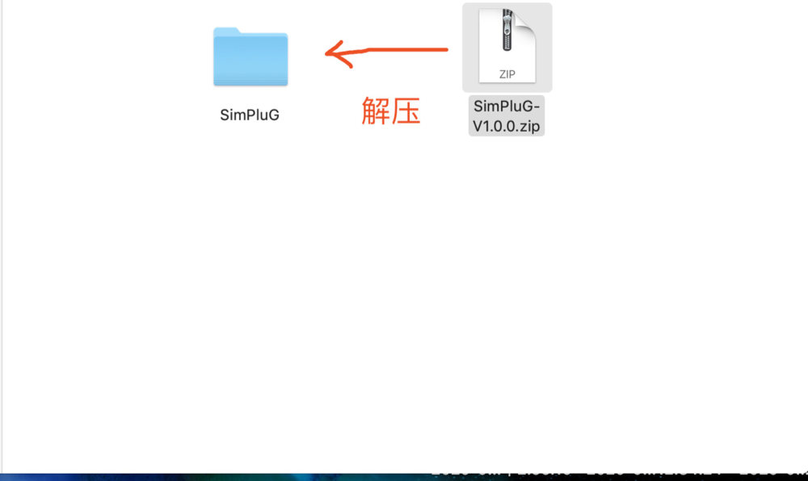
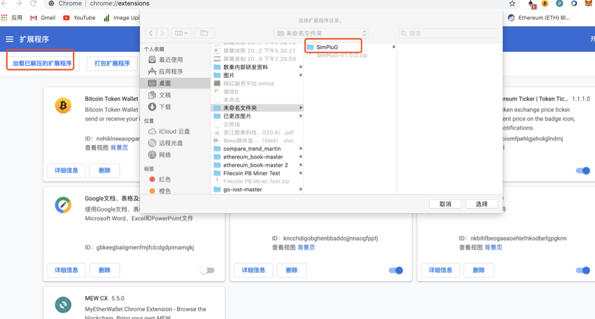
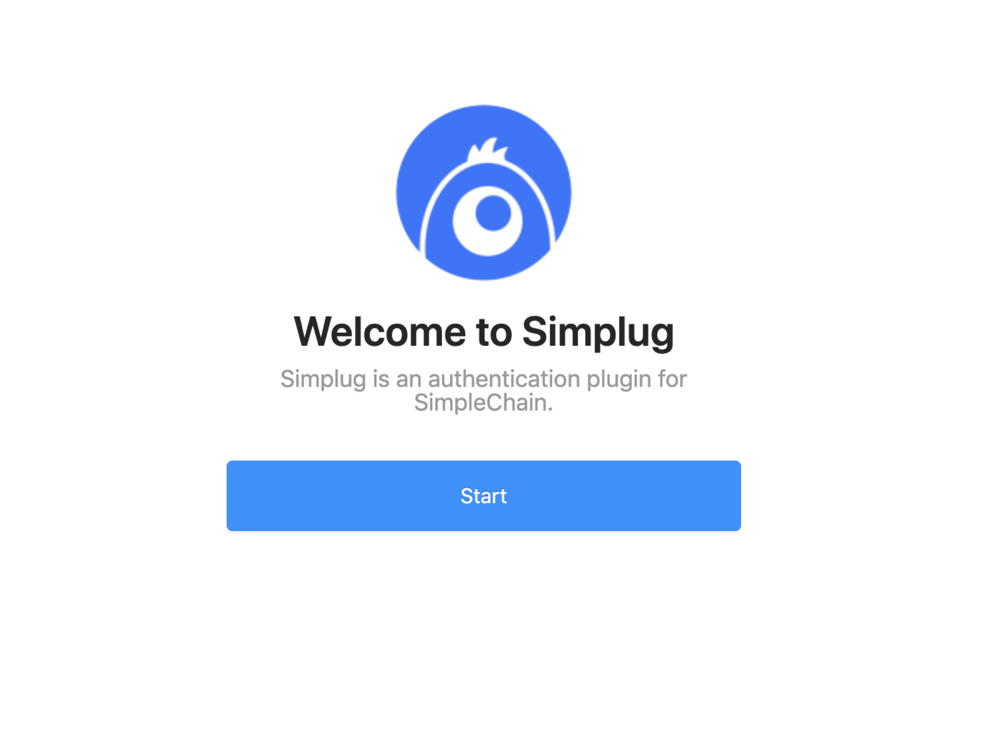
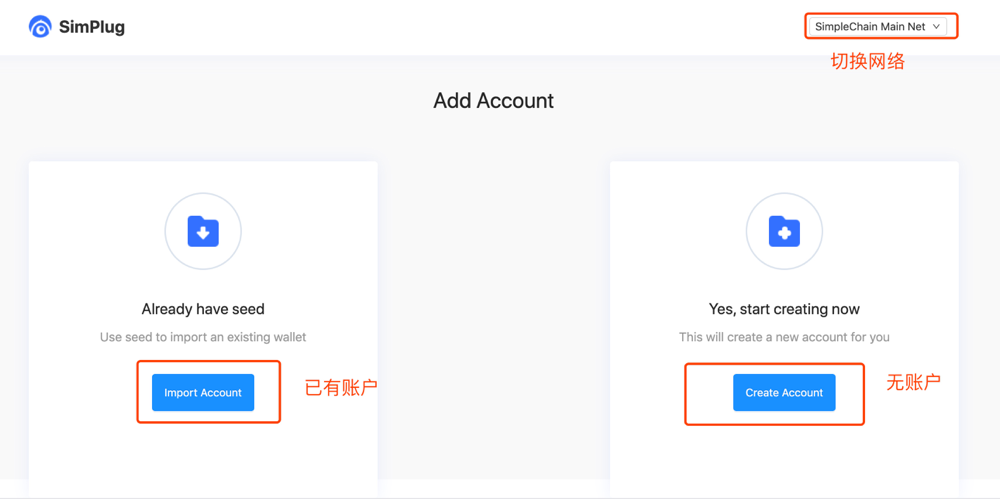
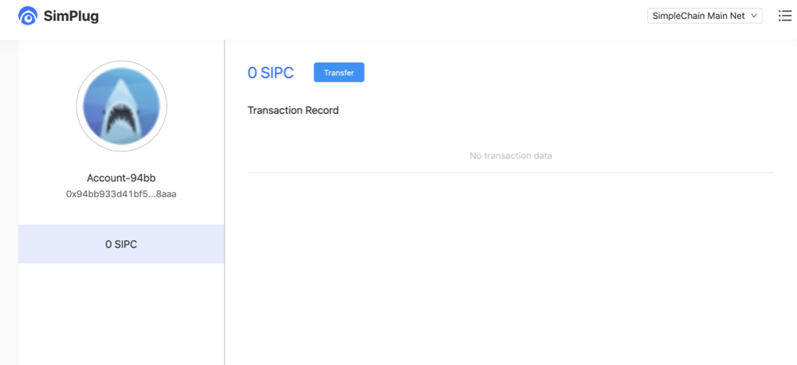

## Download wallet

**Download**

[Plug-In wallet download address](https://wallet.simplechain.com/SimPluG-V1.0.0.zip)

**Decompression**

## Install wallet

1.Open google browser, open the extension program

2.Install the installation package into the extension program

3.Open the wallet after installation

4.Open the wallet and select the main network or test network. If there is already a wallet, import it directly. If there is no account, create an account directly.

5.Create an account and back up the private key to enter your plug-in wallet.

## Wallet call method

**Preconditions**

1. Applications that need to run the plug-in (hereinafter referred to as developers) determine whether the plug-in is available according to window.hasSimplug.
2. Developers need to place a button with the id "run_contract_btn" in the page to trigger the simplug event.
3. Developers need to place a hidden input with the id "run_contract_data" in the page to send transaction data to sumpulg.

**Operation process**

1. The user clicks or the script triggers a button with the id "run_contract_btn.
2. At the same time, developers need to set the input value with id "run_contract_data" to the data to be sent.
3. The plug-in automatically wakes up the call transaction.
