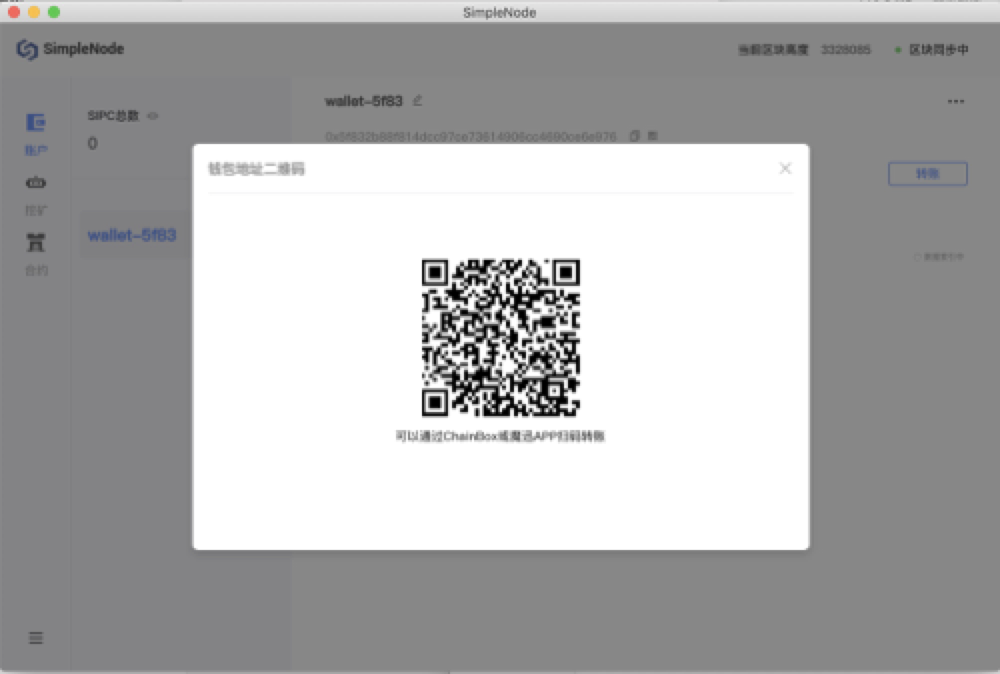
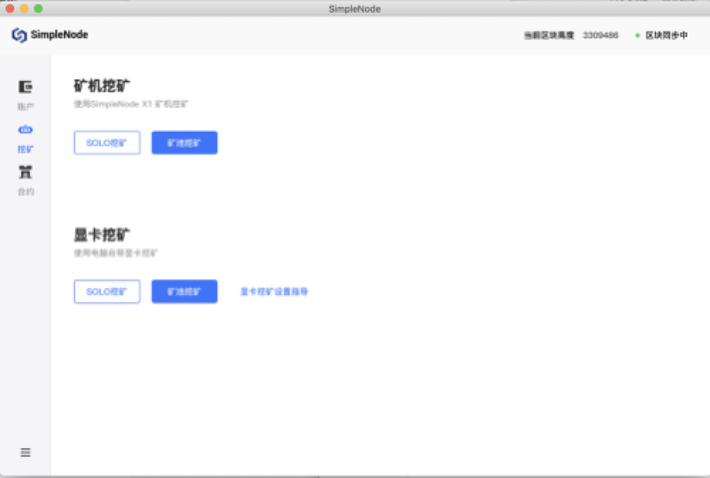
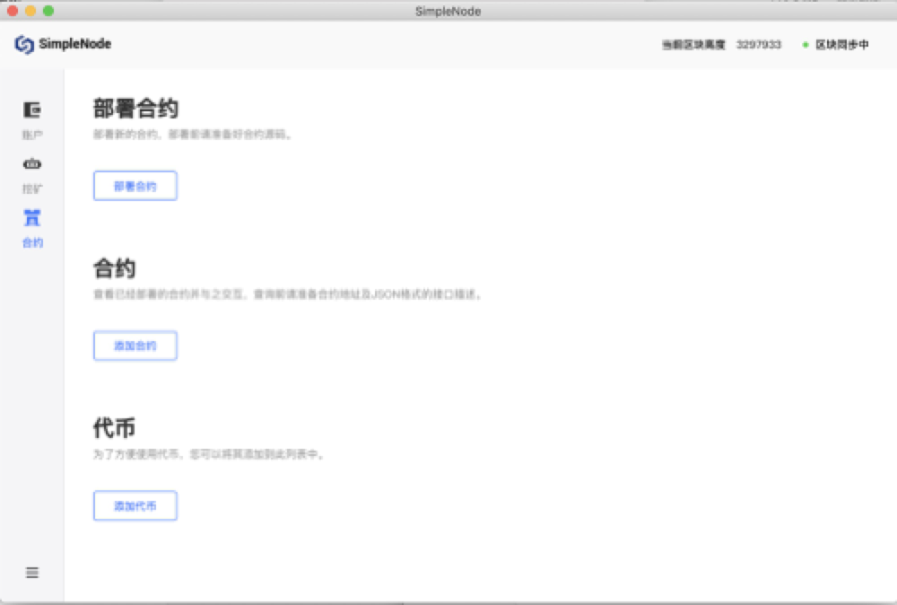

### Docker image building

**Obtain an image：**

```sh
docker pull simplechain/sipe:latest
```
**Start node: **

```sh
docker run -it -p 30312:30312 simplechain/sipe
```
**Enable RPC:**

```sh
docker run -it -p 8545:8545 -p 30312:30312 simplechain/sipe --rpc --rpcaddr "0.0.0.0"
```
**Enable the JavaScript console:**

```sh
docker run -it -p 30303:30303 simplechain/sipe console
```
**Store block data in a specified directory:**

```sh
docker run -it -p 30312:30312 -v /path/on/host:/root/.simplechain simplechain/sipe
```
If RPC is enabled, you can run the following command to check whether your node is successfully started:

```sh
curl -X POST localhost:8545  -H "Content-Type:application/json" --data '{"jsonrpc":"2.0","method":"web3_clientVersion","params":[],"id":68}'
```

### Installation package construction

Open the[official website](https://www.simplechain.com/)of Simplechain and drop down to find the SimpleNode module, as shown in the following figure:


Download the corresponding version according to your server system. After downloading, follow the prompts to install it. After installation, create a wallet account by using the credential. Then you can pay or receive sipc, mining, and publish contracts.

**Account：**



**Mining**



**Contract**




### Source code construction

`Preliminary preparations: Go language environment (1.10 or higher), C language compiler`

**1.Download SimpleChain**

You can clone a project locally through git or  https://github.com/simplechain-org/go- 
Download directly from the simplechain page.

    git clone https://github.com/simplechain-org/go-simplechain.git 

**2.Install sipe**

1.Enter the `go-simplechain` root directory.

```javascript
cd go-simplechain
```

2.Use the make tool to install sipe.

    make sipe
    >>> /usr/local/go/bin/go install -ldflags -X main.gitCommit=9d73f67e1dc5587a95f52c13fee93be6434b42ac -s -v ./cmd/sipe github.com/simplechain-org/go-simplechain/core
    ...
    github.com/simplechain-org/go-simplechain/cmd/sipe
    Done building.
    Run "/Users/yuanchao/go/src/github.com/simplechain-org/go-simplechain/build/bin/sipe" to launch sipe.

When the above output appears on the terminal, the make execution is successful. In this case, the sipe executable file is generated in the go-simplechain/build/bin directory. You can move it to any directory or add it to environment variables to facilitate the running of sipe programs.

### Start sipe

**1.Create a folder for storing node data：**

    mkdir chaindata

**2.Start the sipe Master network node**

Enable the RPC service and specify the RPC listening address as 127.0.0.1, Port `8545`. The node data storage directory is `chaindata`

    ./sipe --rpc --rpcaddr 127.0.0.1 --rpcport 8545 --datadir chaindata 
    
When an output similar to the following appears, the startup is successful and the SimpleChain master Network block is synchronized.

    INFO [06-19|09:35:01.481] Maximum peer count               ETH=25 LES=0 total=25
    INFO [06-19|09:35:01.492] Starting peer-to-peer node       instance=Sipe/v1.0.2-stable-0cbf2a41/darwin-amd64/go1.12.1
    ...
    INFO [06-19|09:35:33.700] Block synchronisation started
    INFO [06-19|09:35:36.756] Imported new block headers       count=192\
    elapsed=22.273ms number=192 hash=bb758a...bea1b6 ignored=0

**3.Start the sipe console**

Create a new terminal window and run the following command to open an interaction console connected to this node. 

    sipe attach chaindata/sipe.ipc

**4.Create an account**

Use the following command to create an account in the started console.

    > personal.newAccount()
      Passphrase:
      Repeat passphrase: "0xc8d8ba3bdba3a1e3ca1d6cd48106d84036f6c0bd" //account address

After the account is created, the console returns the account address and generates a json file for the account in chaindata/keystore. This file can obtain the account private key through password parsing.

**5.Enable mining**

Restart the sipe node，enable mining, and specify the miner address as the account address you created. The number of mining Threads is 1.

    sipe --rpc --rpcaddr 127.0.0.1 --rpcport 8545 --datadir chaindata --mine --minerthreads=1 --etherbase=0xc8d8ba3bdba3a1e3ca1d6cd48106d84036f6c0bd


You can also specify the miner address and enable mining in the console.

    > miner.setEtherbase('0xc8d8ba3bdba3a1e3ca1d6cd48106d84036f6c0bd') 
    > miner.start()

