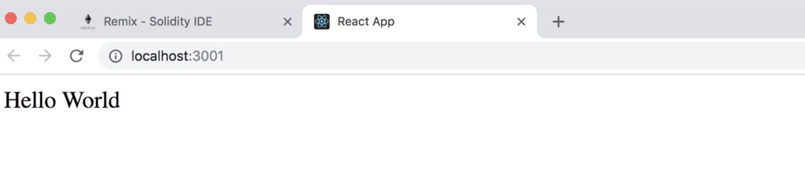
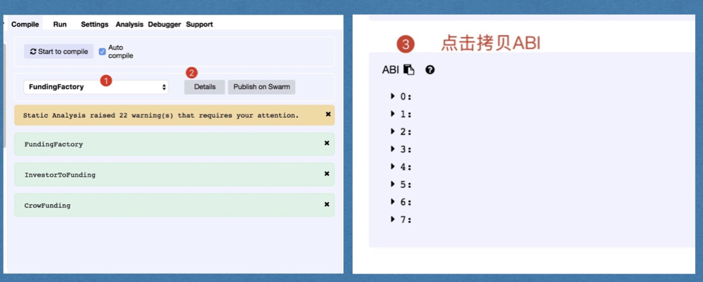

## Initialize React project

The front end is developed based on the React framework, so we first initialize the project.

### Initialize the project

```bash
create-react-app funding-eth-react
```
### Streamline projects

For the lottery project, only App.js and index.js are left under src, and the corresponding code is adjusted.

```javascript
import React, { Component } from 'react';
class App extends Component {
  render() {
    return (
        <div>Hello World</div>
    ); 
  }
}
export default App;
```
Execute the following command:

npm start



### Install dependency libraries

```bash
npm install --save web3
npm install --save semantic-ui-react
npm install --save semantic-ui-css
```

## Reference web3.js

### Implementation

Create a folder named utils under src and create the file getWeb3.js internally

```javascript
import Web3 from 'web3';
let web3;
if (typeof  window.web3 !== 'undefined') {
    console.log('found injected web3');
    web3 = new Web3(window.web3.currentProvider);
} else {
    console.log('found local web3');
    web3 = new Web3('http://localhost:7545');
}
export default web3;
```
## Call crowdfunding contracts

### Deploy Funding to Simplechain test network

Obtain the contract address:

    0x8ff3a13157f1a0aa99beb84d393f1aac4dd470e3 

### Call Funding contract ABI



### Obtain a contract instance

First, create the directory sipc under src and create the file contracts.js.

The ABI format is in json format. You can copy the ABI to the address bar of the browser and format it into a row and then copy it back to save space.

```javascript
import web3 from '../utils/getWeb3';
//将ABI添加到这里
const fundingFactoryABI = [ { "constant": true, "inputs": [], "name": "platformProv ider", "outputs": [ { "name": "", "type": "address" } ], "payable": false, "stateMu tability": "view", "type": "function" }, { "constant": true, "inputs": [], "name": "getInvestorFunding", "outputs": [ { "name": "", "type": "address[]" } ], "payable" : false, "stateMutability": "view", "type": "function" }, { "constant": true, "inpu ts": [], "name": "getCreatorFunding", "outputs": [ { "name": "", "type": "address[]"
} ], "payable": false, "stateMutability": "view", "type": "function" }, { "constan t": true, "inputs": [], "name": "getAllFunding", "outputs": [ { "name": "", "type": "address[]" } ], "payable": false, "stateMutability": "view", "type": "function" },
{ "constant": true, "inputs": [ { "name": "", "type": "uint256" } ], "name": "crow FundingArray", "outputs": [ { "name": "", "type": "address" } ], "payable": false, "stateMutability": "view", "type": "function" }, { "constant": true, "inputs": [ { "name": "", "type": "address" }, { "name": "", "type": "uint256" } ], "name": "crea torFundingMap", "outputs": [ { "name": "", "type": "address" } ], "payable": false, "stateMutability": "view", "type": "function" }, { "constant": false, "inputs": [ { "name": "_projectName", "type": "string" }, { "name": "_supportMoney", "type": "uin t256" }, { "name": "_goalMoney", "type": "uint256" }, { "name": "_duration", "type" : "uint256" } ], "name": "createFunding", "outputs": [], "payable": false, "stateMu tability": "nonpayable", "type": "function" }, { "inputs": [], "payable": false, "s tateMutability": "nonpayable", "type": "constructor" } ];

const fundingFactoryAddress = '0x8ff3a13157f1a0aa99beb84d393f1aac4dd470e3';
//创建fundingFactory合约实例
let fundingFactoryContract = new web3.eth.Contract(fundingFactoryABI, fundingFactor yAddress);
let contracts  = {
    fundingFactoryContract,
}
export default contracts;
```
There are many modules in the whole front-end development. In the following interface development step diagram, we can see that the whole interface includes the crowdfunding I initiated, all the crowdfunding, and the crowdfunding I participated in and other modules. As shown below:


The preceding steps have already implemented the basic framework of the entire front-end page and the contract call case. The development of other modules is similar to the preceding steps. No more detailed introduction, you can directly view the source code to learn.


