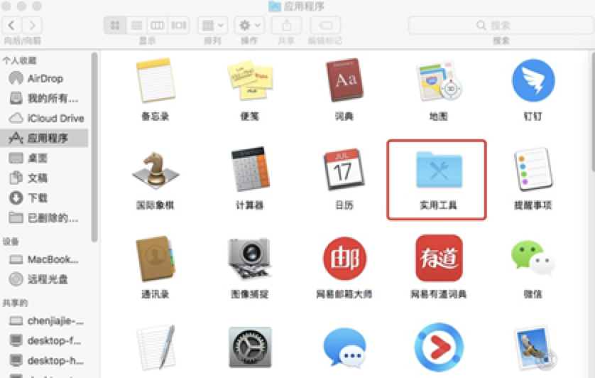

## Window version

**Note: This GPU mining only supports linking mining pools**

`SImpool address`：https://simpool.vip

`GPU mining address`：http://suo.im/5E6IrE

### Mining pool registration process:

Step 1: register a mine pool account (the user name is preferably in English);

Step 2: Enter account settings;

Step 3: Design the payment address in the Personal Center (otherwise the system can't make coins);

**Special attention:**

1. The account name is very important. The name must be followed by the account user name after the mine pool.

### Download the files required by the GPU

Download address: https://github.com/simplechain-org/gpuminer/releases（Be sure to download the latest version, the latest version is more efficient! The latest version is 1.0.3)


 
### Decompress the modified file


Decompress the compressed file into a folder. Click in, find the file start.bat, and edit it with Notepad:


After the modification, double-click start.bat to link the mine pool. The screenshot after the modification is successful:


After accessing the mine pool, you can log on to your mine pool account on each mine pool official website to view your income.

### Mac version

SimpleChain official GPU mining tutorial (MAC)

Note: This GPU mining only supports linking mining pools

Simpool website：https://simpool.vip

Download the software required for GPU mining：http://suo.im/5E6IrE

### Mining pool registration process:

- Step 1: register a mine pool account (the user name is preferably in English);
- Step 2: Enter account settings;
- Step 3: Design the payment address in the Personal Center (otherwise the system can't make coins);

**Special attention**

- The account name is very important. The name must be followed by the account user name after the mine pool.

### Download the files required by the GPU

Download address：hhttp://suo.im/5E6IrE


### Decompress the modified file

Decompress the compressed file into a file and put it on the desktop:


Then open the command line mode and find the terminal and terminal in the utility tool:




 
First `cd desktop` enter the desktop (the file you just downloaded is on the desktop by default), and then obtain the permission to operate the file you just downloaded, `chmod +x gpuminer` (If the file is on the desktop, you can paste it!):


After obtaining the permission, enter the command to start the file:

```bash
./gpuminer –server simpool.vip:8801 –name abc(118.31.45.65:8801是矿池地址，每个矿池的地址不一样，abc是账户名称,一定填自己账户。)运行成功后：
```


 


