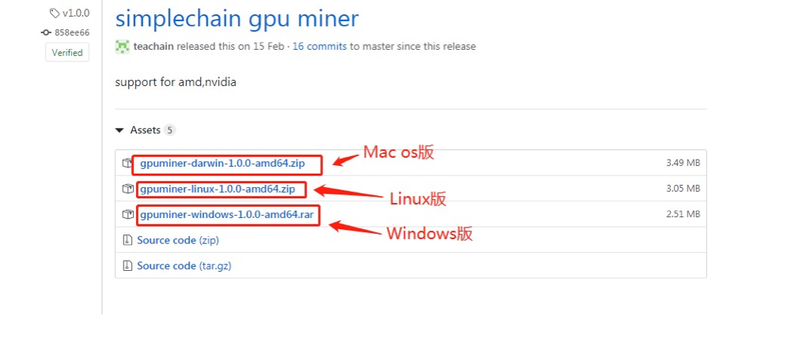

Simpool mining tutorial

**Mining method**

**Mode 1 :**: register an account for mining in Simpool, the official website of the mining pool.

**Mode 2:**: use simpleNode(V1.0.0 version) to connect to the mining pool for mining.

## Mine pool registration

1. Register the mine pool account (do not enter the account name in Chinese); Account registration address: https://simpool.sipc.vip/enroll
2. Enter account management to set the payment address (otherwise the system cannot make coins).

## Link mining pool mining

**Special attention:**

1. name is followed by the miner user name, the best format is the account name. xxx (Miner name does not have Chinese) or directly the account name

2. It is very important which account the miner belongs to, and the income is distributed according to the payment address under the corresponding account name.

## Download the files required by the GPU

The address is here: https://github.com/simplechain-org/gpuminer/releases（Be sure to download the latest version, the latest version is more efficient!`最新版本是1.0.4`）

## Decompress the modified file

Download the compressed file and decompress it into a folder. Click in, find the file start.bat, and edit it with Notepad:

1. -gpuplatform 1 Select Card A for mining;

2. -gpuplatform 2 choose N card for mining;

3. -gpuplatform 3 select hybrid multi-card mining.

After modification, save it and turn it off. Double-click start.bat to link the mine pool and take a screenshot. After accessing the mine pool, you can log on to your mine pool account on the mine pool official website to view your income.

## SimpleNode（V1.0.0 version）mining pool mining

SimpleNode download address：https://www.simplechain.com/，select the corresponding version to install according to your system, and start the application after the installation is successful.

**Specific mining steps:**

一. Start SimpleNode, click the "start mining" button in the upper right corner, and the mining method pop-up window appears

二. Mining method selection:
1. Mining method: Select "mining pool mining" in the popup window of mining method ";
2. Miner name: if you have not registered a Simpool account, you need to click the "Click register" button on the right side of the miner name to go to the Simpool registration page. After the registration is successful, return to the previous SimpleNode mining page; if you have registered a Simpool account, enter the miner name directly in the miner name editing box (Miner name does not contain Chinese)
3. Graphics card type: select the type of graphics card, according to your computer's graphics card to choose (wrong choice, mining has no computing power)

**Special attention:**

1. When you register an account or add an account in Simpool, the account name must not be in Chinese.

2. Miner name, the best format is the account name. xxx (account name is the account name in the Simpool) or directly the account name

3. It is very important which account the miner belongs to, and the income is distributed according to the payment address under the corresponding account name.

三. Click the OK button to mine. You can click view revenue in the upper right corner to view your revenue

