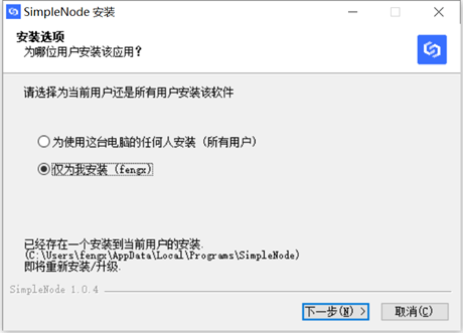
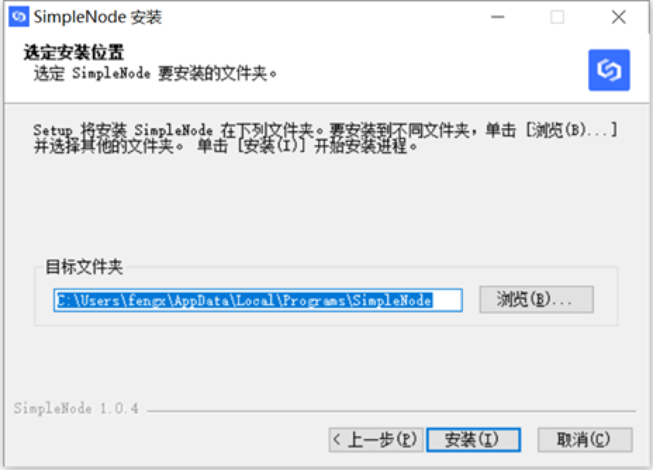
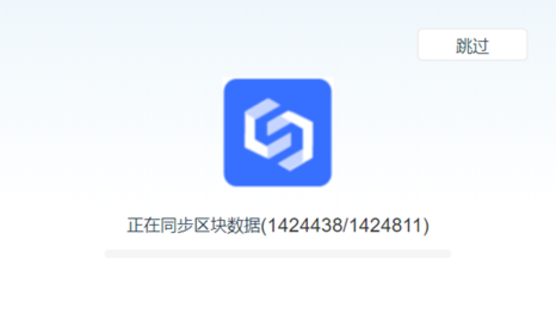
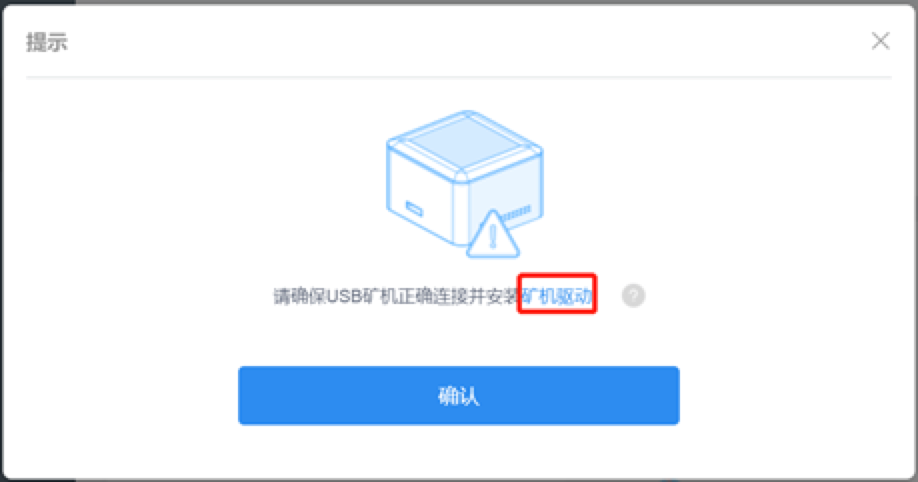
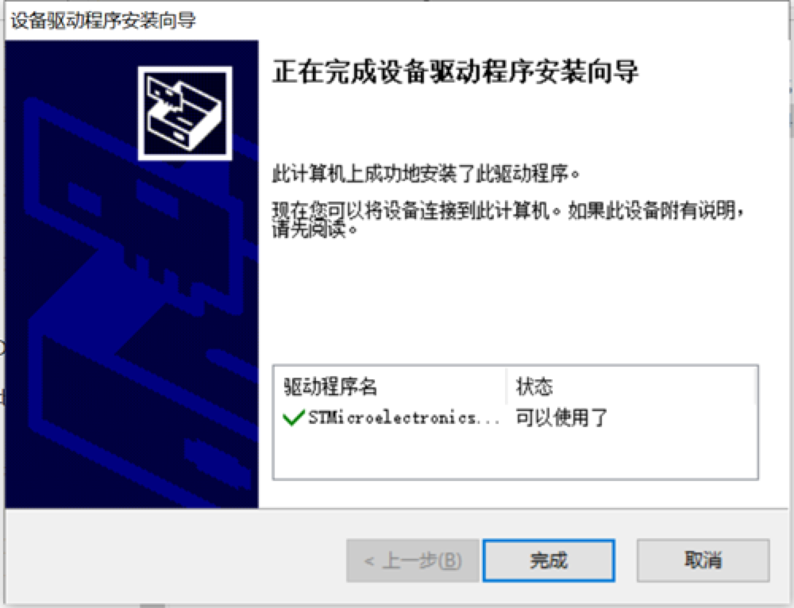
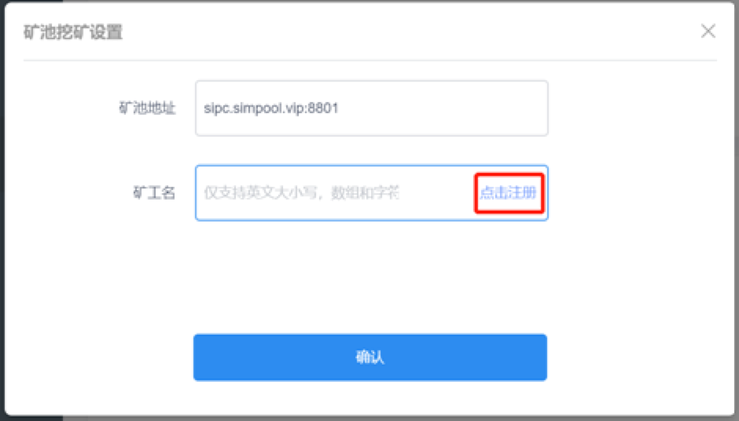
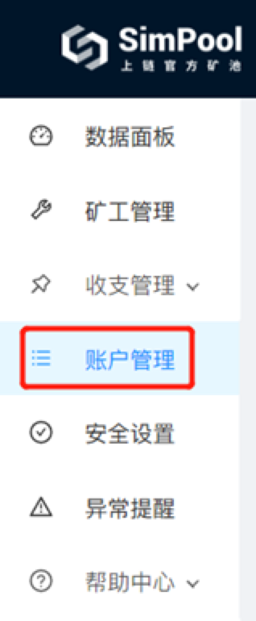
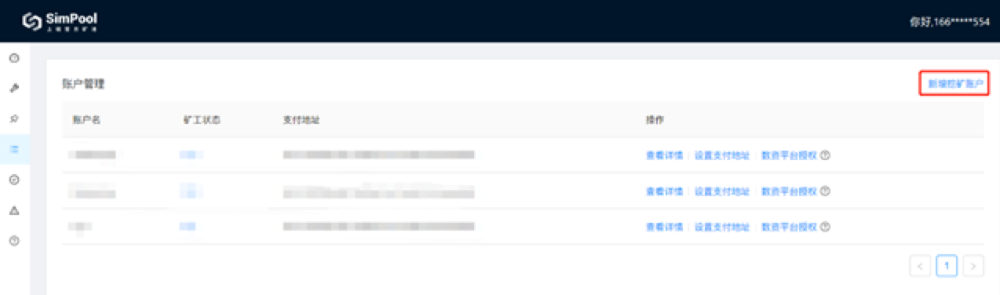
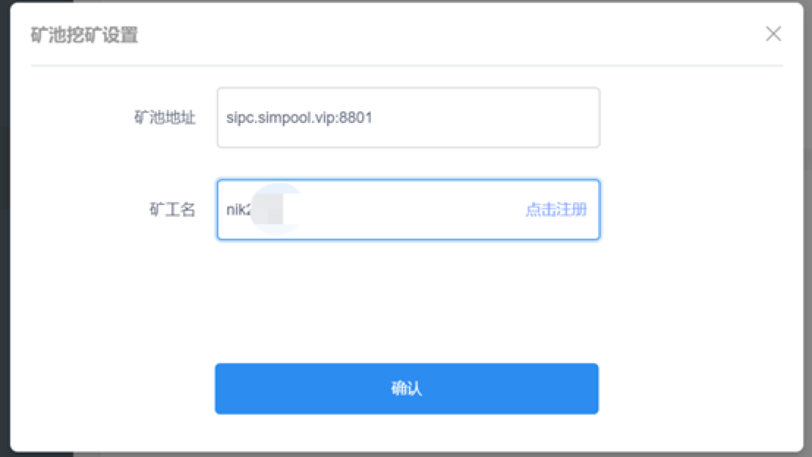

After getting the mining machine, you need to complete the following three steps to make the mining machine run and dig out the benefits!

- Prepare SimpleNode software
- Install the miner driver (Windows system needs to be installed, MacOS and Linux do not need to be installed)
- Join the official [ Mine pool Simpool](https://simpool.sipc.vip),start mining！

## Prepare SimpleNode software

1. Go to the official website of SimpleChain (www.simplechain.com), find SimpleNode, and download the corresponding version of the installer according to your computer system.

2. Open SimpleNode installer and follow the prompts to complete the installation.

3. After the installation, run SimpleNode

4. After data synchronization is complete, follow the prompts to create an account or import an existing account. After creating an account, please make a backup to ensure the security of your funds!

## Install mining machine driver

**Windows system needs to be installed, MacOS and Linux do not need to be installed**

1. After creating the account, select "Solo mining" or "mining pool mining" after "mining machine mining" in SimpleNode software, and a prompt box will pop up. Click the blue word "mining machine driver, automatically download the mining machine driver installation package.

2. The miner driver installation package is a compressed file, please decompress the file. Decompress the file and click the "stmicroel_virtual_131_64" application to start installing the miner driver.

3. Complete the installation of the driver of the mining machine according to the instructions of the installation wizard.

## Start Mining!

After the installation of the driver is completed, insert the mining machine, and choose "Solo mining" or "mining pool mining" after "mining machine mining" in SimpleNode software again, then you can start the mining machine mining and a journey full of money!

**We recommend that you use the "mining pool" method to add the official mining pool Simpool**，more benefits! To select this method, you need to register an account in the official mine pool Simpool.

1. Click "mining pool mining" behind "mining machine mining", click "blue", click "register" to enter the registration page of the official mining pool Simpool

2. Complete the Simpool account registration as prompted

3. After the registration is successful, find "account management" in the left-side navigation pane and click to enter

4. Click "Add mining account" in the upper right corner; You need to enter "account name" and "SIPC payment address"
Account name: English uppercase letters and numbers are supported (Chinese characters are not supported!)
SIPC payment address: This address is the receiving address of mining revenue. Please fill in your SIPC Wallet account address.

  

  

5. Your Wallet account address can be viewed in SimpleNode; If you are using the official Chainbox wallet and sipc.vip digital resource platform, you can also fill in your address (note: Please fill in your own address that supports SIPC correctly, and the mining revenue will be transferred to this address!)

6. After completing the operation in Simpool, return to SimpleNode software and click "mining pool mining" after "mining machine mining" again ", fill in the miner name (the miner name is the" account name "you just filled in when adding a mining account in Simpool), click OK, click OK, mining begins (the blue light of the mining machine is flashing)!

