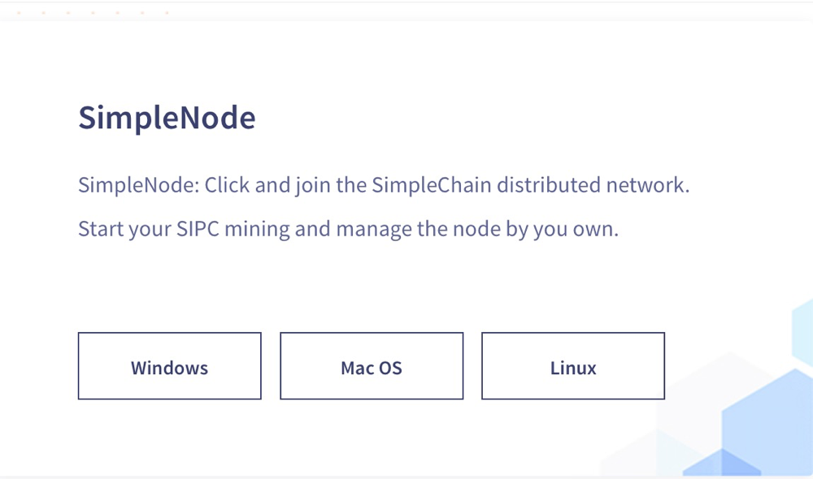
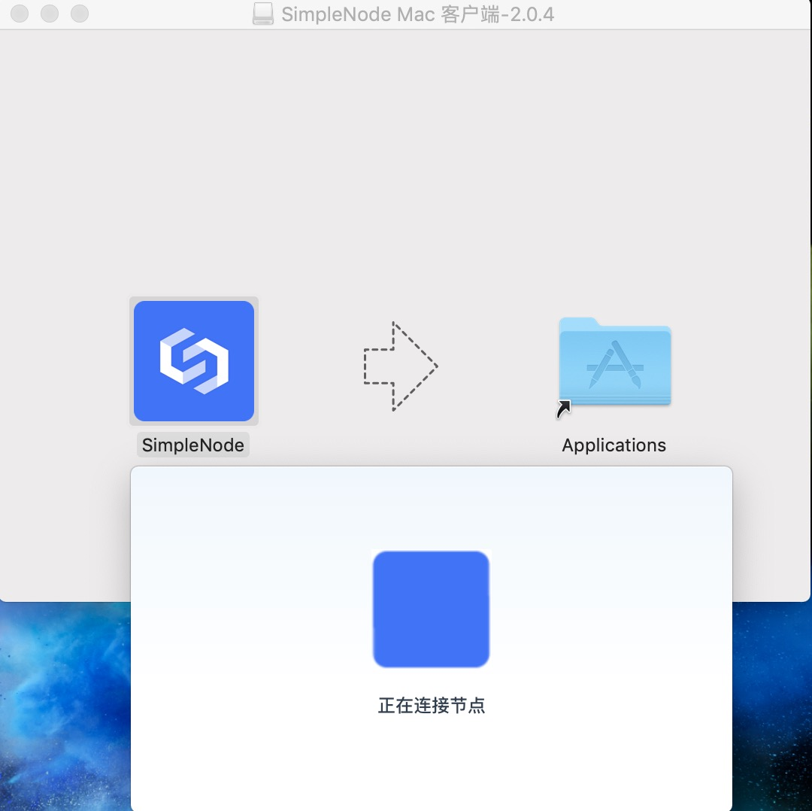
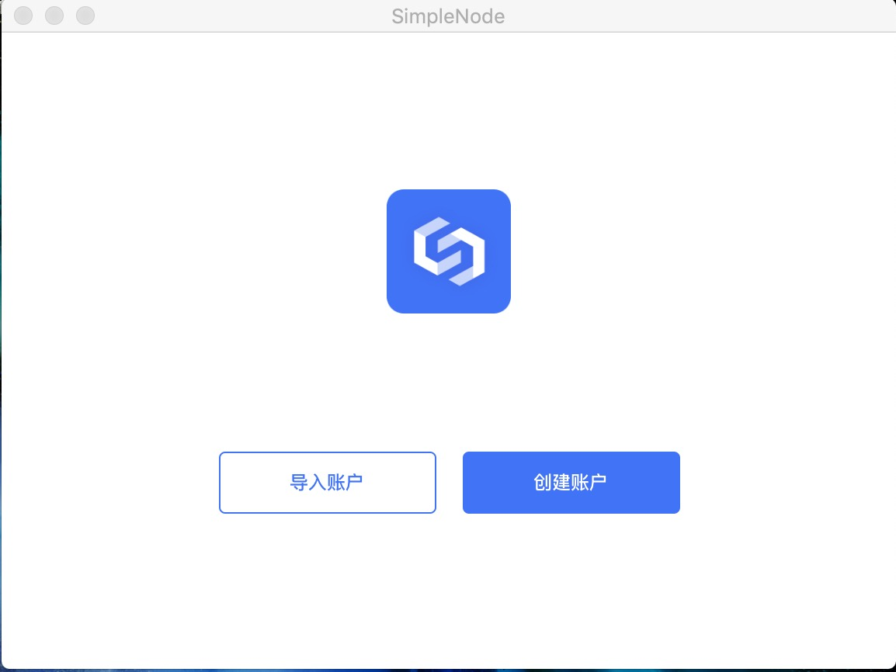
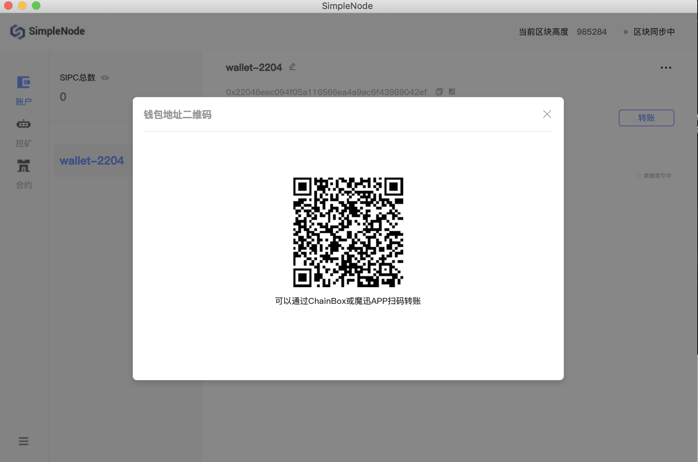

> Open Simplechain[Website](https://www.simplechain.com),and then drop down to find the SimpleNode module, as shown in the following figure:

> Currently, there are three versions of the full-node wallet:`windows`,`Mac OS`, `Linux`。Download the corresponding version according to your computer (server) system, and follow the installation steps after downloading. The following is an example of Apple Computer: download `Mac OS` After unzipping the file, you can see the logo of the wallet. Then click open, as shown in the following figure:

> After opening the wallet, you will see the prompt on the wallet page:`正在链接节点`，as shown below:

> After connecting the node, we can see the desktop wallet prompt `正在同步区块数据`。Click `跳过`，you can directly enter the wallet. As shown below:

> After entering the wallet, if you have already used the wallet, you can choose to import the account, if this is the first time you use the wallet. You need to click`Create Account`，as shown below:

> If Select `import account`，there are three ways to import wallet, which are`keystore文件导入`, `keystore明文导入`，`私钥导入`。You can import according to your own private key.

> If you use SimpleNode for the first time, you must create an account. Just set your own wallet `密码`以及`确认密码`，the wallet is successfully created after confirmation.

> After successful creation, we can see the Wallet account address to prevent the wallet from being lost due to forgetting the password. So should `立即备份`.As shown below：

> What I click here is `备份私钥`，you can also choose to back up the keystore file.

> Then you can see the private key information of our backup. Then click `open SimpleNode`, then enter the wallet.

> After entering the wallet, you can see the total number of SIMPLE, the current synchronization block height, and the wallet address. Click the collection code to receive the SIMPLE, as shown in the following figure:

> Of course, it can also be used for transfer, click `transaction` on the transfer page, enter the corresponding recipient's address and transfer the number of SIMPLE. And adjust the Gas fee, then transfer the money. As shown below:

