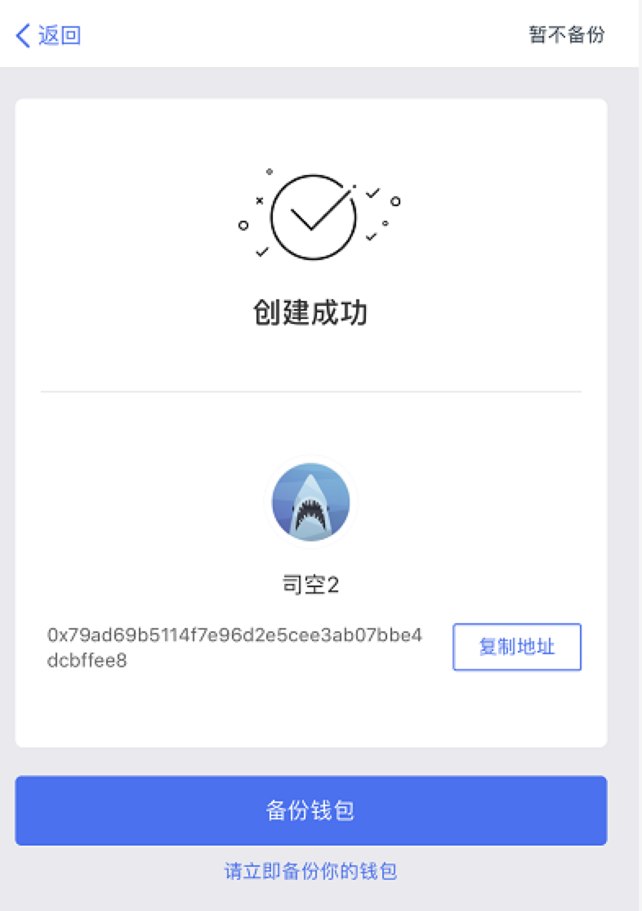

## Download ChainBox wallet

1. Apple Android installation address: https://www.simplechain.com/download Or scan the QR code below to download.

After the IOS installation is complete, please: `打开设置`———`通用`———`设备管理`———`Broadway International Sp . z.o.o`———`信任应用`———`回到桌面打开钱包APP`———`创建注册`。

## Create a registered wallet

1. First enter the wallet name (both in Chinese and English), then enter the wallet password (at least 8 digits, including numbers and letters), then Gou Xuan the protocol, and finally click create wallet, the wallet is created.

## Wallet created successfully

1. Backup wallet: write down the auxiliary words. Next, assist to verify whether the auxiliary words are correct or not (the auxiliary words can only be screenshots and cannot be copied). Enter the auxiliary words in sequence and confirm. --- Create successfully and jump to the wallet page

2. If you want to enter the wallet page quickly -- Optional, jump to the wallet page directly without backup in the upper right corner --- back up the wallet in the wallet settings next time (it is strongly recommended to back up the wallet first)

## Import wallet (function key in upper left corner to enter)

1. If you have ever downloaded a ChainBox wallet and created a wallet, you can choose to import your wallet.

2. You can import it in any way, such as mnemonic words, official wallet (keystore), private key, and then reset the password.

## Wallet list (function key in upper left corner to enter)

1. You can see at a glance the wallet assets and wallet addresses of multiple wallets that you have created or imported.

2. You can also select a wallet you imported or created in the wallet overview.

## Wallet settings (function key in upper left corner to enter)

1. You can change the wallet name and password;

2. If you need to export the wallet, you can export the private key, keystore, and backup memo in the wallet settings.

3. If you have extra wallet, you can also delete it from the bottom of the wallet settings if you want to delete it.

## Transfer/Collection (function key in the upper left corner to enter)

1. Click SIPC in the wallet to enter the details page: transfer/Collection

2. Click transfer: ordinary transfer/offline transfer (additional remarks the Data in the advanced transfer options is transfer notes, which are generally not written because of the significant increase in the gas fee of the note information)

3. Ordinary transfer (hot wallet function): Fill in the address, quantity and miner fee of the other party. Enter the password next.

4. Offline transfer (cold wallet function): Fill in transfer address, account Collection Address, transfer quantity and miner fee.

## General purpose: Contact/Message Center/check for updates (function key in the upper left corner to enter)

1. Contact person: add common transfer address to facilitate the second transfer.
2. Message Center: you can see the summary of transfer and collection information.
3. Check for updates: Check for updates to the latest wallet version

