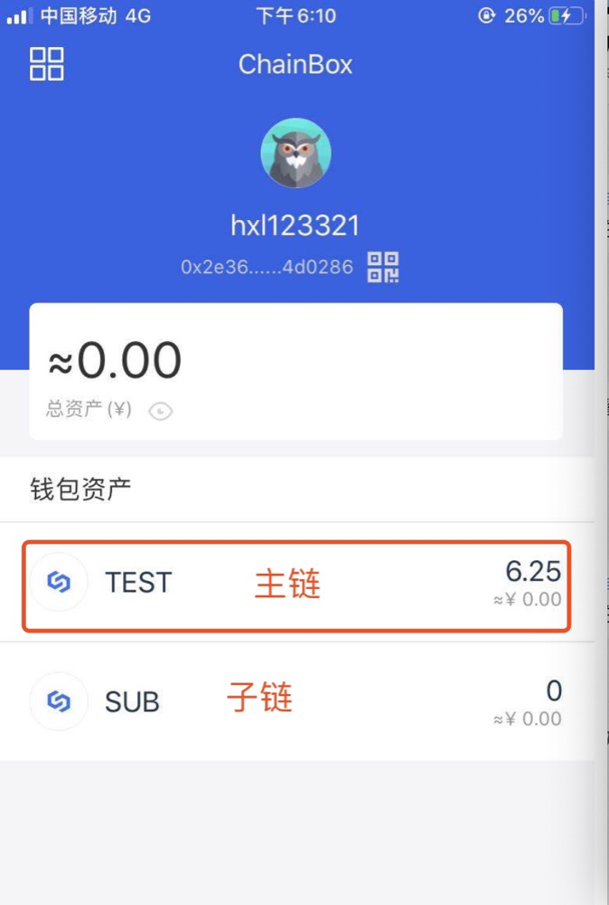
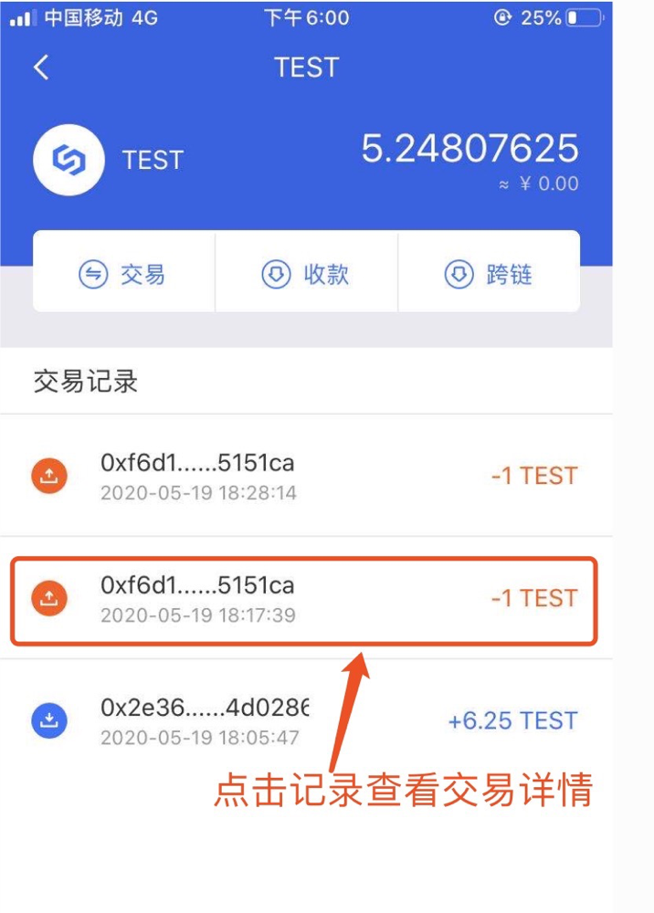
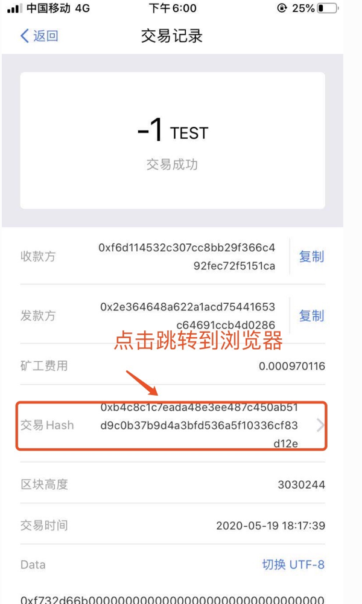
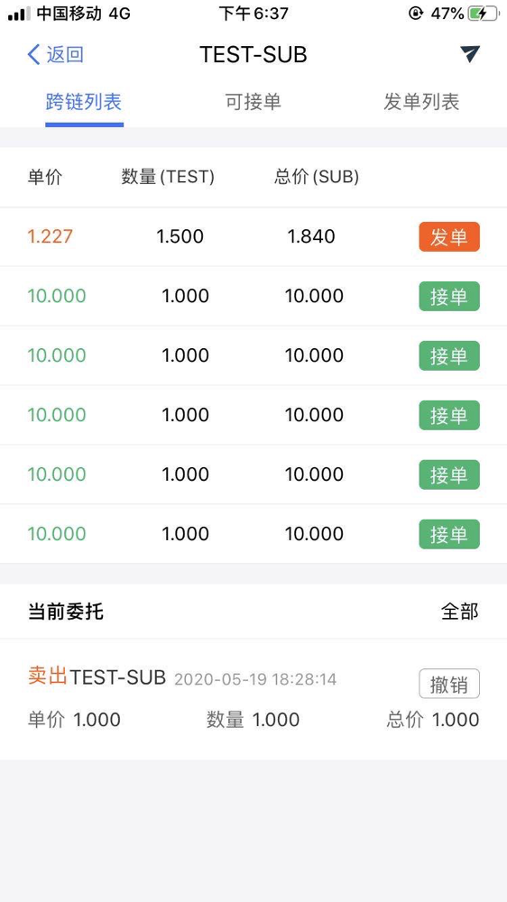

Simplechain is a hybrid public chain with a master and sub-chain architecture. Cross-platform migration of assets between different chains involves cross-chain operations. The following is a detailed cross-chain process:

### Download ChainBox

Download the corresponding according to your mobile device system ChainBox Installation package, keep your private key after registering your wallet. Find the wallet address and copy the wallet address. As shown below:

### Get test assets

Turn on the tap, tap address: [Test network faucet](http://47.110.48.207:8080/)

Enter the wallet address copied in the previous step into the tap, and you can receive the test currency. As shown below:

### Cross-chain transactions

#### Cross-chain entry

Open the wallet and enter the homepage. All the coins and their discount of the wallet in the chain ecosystem are displayed in the wallet assets (as shown in the following figure)

Click a wallet asset (TEST) to enter the main chain transaction page (as shown in the following figure)

Click the "cross-chain" button in the above figure to enter the transaction pair selection interface (as shown in the following figure). Only one transaction pair is provided here.

Click `SUB` enter the cross-chain trading market. The cross-chain list in the following figure shows the orders between the main chain and the sub-chain. The red unit price records the orders sent from the main chain to the sub-chain, and the green unit price records the orders sent from the sub-chain to the main chain. The cross-chain list is arranged by unit price from high to low. For more records, click the Tab page. `receive transaction` and`Send transaction list`Query and display. The current delegation page displays the cross-chain transaction orders that the current account participates in. Click `all` you can display all commissioned orders and historical cross-chain transactions.

#### Order receiving:

Click to receive an order in the red wirebox above to clinch a cross-chain transaction. This transaction means that you sell one TEST and get 10 SUB at the unit price of 0.1SUB/TEST. See the following figure

After entering the wallet password, click "confirm" to send out an on-chain transaction. The transaction can be completed after the transaction is confirmed (about 6 minutes). Click "all"-> "history" to see the cross-chain transaction records that have just been closed, as shown in the following figure:

#### View transaction details in the browser

View cross-Chain records:

View transaction details:

Browser view details:

Returning to the homepage of the wallet, I found that the SUB-chain coins have increased by 10 SUB-chains, and the handling fee is 0.001 TEST, which is far less than the handling fee rate of 0.2% of that of ordinary exchanges.

#### Billing

Click the "issue" button in the cross-chain trading market to enter the issue process.

Click "next", enter the password and click "confirm".

After the transaction is sent successfully and the transaction is confirmed (about 3 minutes), we can find that a new record has been added to the current delegation page of the account. At this moment, all users in the network can query the delegation, indicates that the order is issued successfully. User's`TEST`Reduce 1

#### related orders

Select the commission record above and click "withdraw order" to enter the withdraw order process.

Enter the password and click "confirm" to send the transaction. After the transaction is confirmed (about 6 minutes). The user delegation list is empty, and a new withdraw record is added to the history.

Back to the home page, the TEST that has just been reduced has also returned.

