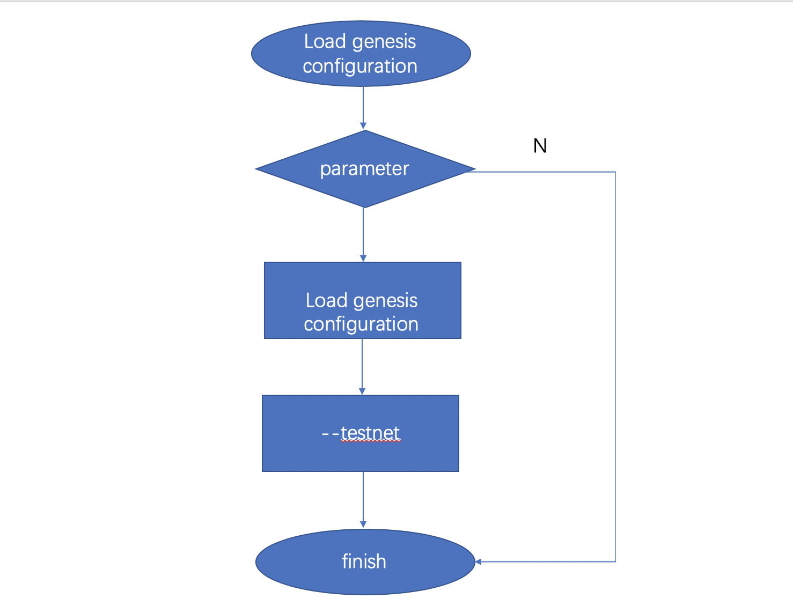

The genesis block is the zero th block, and other blocks are directly or indirectly referenced to the genesis block.

Therefore, the correct creation block information must be loaded at the beginning of the node startup and cannot be arbitrarily modified.

[SimpleChain](https://www.simplechain.com/)you can use the creation configuration file to initialize the creation block. You can also use the creation configuration that uses multiple built-in network environments.
Default use[SimpleChain](https://www.simplechain.com/) Master network creation configuration.

## Genesis configuration file

If you need to build [SimpleChain](https://www.simplechain.com/) private chain, then it is necessary to understand the creation configuration, otherwise you don't care about the creation configuration.

The following is an example of creation configuration in JSON format:

```json    
{
"config": {
    "chainId": 100, 
    "homesteadBlock": 0, 
    "eip155Block": 0, 
    "eip158Block": 0
},
"alloc" : {},
"coinbase" : "0x0000000000000000000000000000000000000000",
"difficulty" : "0x20000",
"extraData" : "",
"gasLimit" : "0x2fefd8",
"nonce" : "0x0000000000000042",
"mixhash" : "0x0000000000000000000000000000000000000000000000000000000000000000", "parentHash" : "0x0000000000000000000000000000000000000000000000000000000000000000", "timestamp" : "0x00"
}
```

According to the configuration usage, it can be divided into three categories:

1. Chain configuration

+ `config`the item defines the chain configuration, which affects the consensus protocol. Although the chain configuration has little impact on Genesis, the block-out rules of new blocks all depend on the chain configuration.

2. Information configuration of Genesis block head  

+ `nonce`：random number, corresponding to the genesis block `Nonce` Field.
+ `timestamp`：UTC timestamp, corresponding to the genesis block `Time` Field.
+ `extraData`：additional data, corresponding to the genesis block `Extra` Field.
+ `gasLimit`：required, fuel upper limit, corresponding to the genesis block `GasLimit` Field.
+ `difficulty`：required, difficulty coefficient, corresponding to the genesis block `Difficulty` Field. When building a private chain, you need to select the appropriate difficulty value according to the situation to adjust the block.
+ `mixHash`：a hash value, corresponding to `MixDigest` Field. Together with the nonce value, sufficient calculations have been performed on the block.
+ `coinbase`：An address corresponding to `Coinbase` Field.

3.Initial account asset allocation

+ `alloc` Item is the initial account asset allocation in Genesis. When a genesis block is generated, the account assets in this dataset are written into the block, which is equivalent to pre-mining.
This is very useful for development testing and private chains. You can directly allocate assets to any number of accounts without mining.

## Chuangshi block loading process

When running Simplechain, you must load the creation configuration and the creation block according to the configuration file, and verify its validity.
If the configuration information is changed at will, problems such as consensus verification failure may occur. The program can continue to run only when loading and checking pass.


The preceding figure shows a brief process. The following two sub-processes are "loading the creation configuration" and "installing the creation block.

## Load Genesis configuration

Which Creation configuration should be used depends on when the user starts Sipe. The following figure shows the flow chart of creation configuration selection:




You can use Sipe command parameters to select different network configurations `networkid` Select, you can also use the network name to enable.

1.Use networkid, Different networks use different ID.

-  1=Frontier，main network environment, is the default option.
-  2=Morden test network, but disabled.
-  3=Ropsten test network.
-  4=Rinkeby test network.

2.Directly use the network name:

-  testnet: Ropsten tests the network.
-  rinkeby: Rinkeby tests the network.
-  goerli: Görli tests the network.
-  dev: local development environment.

When Sipe is started, select to load different network configurations according to different parameters and correspond to different network environments. If no choice is made, although no choice is made here, the main network configuration will be used by default in the subsequent process.

## Install the genesis block

First, you need to read the genesis block hash from the database based on the block height 0.
If it does not exist, the local startup is the first time. Use the runtime creation configuration directly to build the creation block.

For the first time, you also need to store the creation block and chain configuration.

If it exists, you need to use the runtime creation configuration to build the creation block and compare it with the created block hash that has been stored this time.
Once inconsistent, an error is returned and cannot continue.

Then, you need to check the chain configuration. Obtain the chain configuration from the database first. If it does not exist, use the runtime chain configuration directly without verification.

Otherwise, check whether the runtime chain configuration is correct and replace the update only when it is correct.
However, there is an exception: the Master network configuration cannot be changed at will and is controlled by code rather than manually specified.
In general, Simplechain uses the Master network configuration by default. It only creates and stores the creation block when it is running for the first time. In other cases, it is only used for verification.

In addition to the main network, the chain configuration can be changed at any time under the rules.

## Build and create blocks

We have known the overall process above. Here we will describe in detail how Simplechain generates creation blocks based on the creation configuration.
The core code is located in `core/genesis.go:229`:

```go
func (g *Genesis) ToBlock(db ethdb.Database) *types.Block{
    if db == nil {
        db = rawdb.NewMemoryDatabase()
    }
    statedb, _ := state.New(common.Hash{}, state.NewDatabase(db))//1
    for addr, account := range g.Alloc { //2
        statedb.AddBalance(addr, account.Balance)
        statedb.SetCode(addr, account.Code)
        statedb.SetNonce(addr, account.Nonce)
        for key, value := range account.Storage {
            statedb.SetState(addr, key, value)
        }
    }
    root := statedb.IntermediateRoot(false)//3
    head := &types.Header{//4
        Number:     new(big.Int).SetUint64(g.Number),
        Nonce:      types.EncodeNonce(g.Nonce),
        Time:       g.Timestamp,
        ParentHash: g.ParentHash,
        Extra:      g.ExtraData,
        GasLimit:   g.GasLimit,
        GasUsed:    g.GasUsed,
        Difficulty: g.Difficulty,
        MixDigest:  g.Mixhash,
        Coinbase:   g.Coinbase,
        Root:       root,
    }
    //5
    if g.GasLimit == 0 {
        head.GasLimit = params.GenesisGasLimit
    }
    if g.Difficulty == nil {
        head.Difficulty = params.GenesisDifficulty
    }

    statedb.Commit(false)//6
    statedb.Database().TrieDB().Commit(root, true)//7

    return types.NewBlock(head, nil, nil, nil)//8
}
```

The preceding code is the code logic that generates the creation block based on the creation configuration. The details are as follows:

1. Genesis block has no parent block, initialize the new from zero `state` (Follow-up articles will be explained in detail `state` Object).
2. Traversal configuration `Alloc` Item account collection data, directly written to the state.
   Not only can be set here `balance` , you can also set `code` , `nonce` And any multiple `storage` Data.

  It means that smart contracts can be deployed directly when creating the world. For example, the following configuration deployed a configuration named`093f59f1d91017d30d8c2caa78feb5beb0d2cfaf`smart contract.

```json
"alloc": {
    "093f59f1d91017d30d8c2caa78feb5beb0d2cfaf": {
        "balance": "0xffffffffffffffff",
        "nonce": "0x3",
        "code":"0x606060",
        "storage":{
            "11bbe8db4e347b4e8c937c1c8370e4b5ed33adb3db69cbdb7a38e1e50b1b82fa":"1234ff"
        }
    }
}
```

3. After the account data is written into the state, the root value of Merkel tree for the state data can be calculated, which is called StateRoot .
   This value is recorded in the block header Root Field. 
4. Part of the creation configuration is directly mapped to the block header to complete the creation of the block header.
5. Because `GasLimit` And `Difficulty` Directly affects the next block outbound processing.Therefore, the default configuration is used when it is not set (Difficulty = 131072,GasLimit = 4712388).
6. Submit the state to submit the state data to the underlying memory trie data.
7. Update memory trie data to db. This is an unnecessary step, because the submission to the database is done externally, here you only need to be responsible for generating blocks.
8. Use the block header to create a block, and there is no transaction record in the block.


