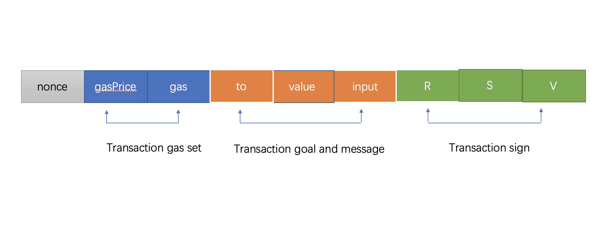

[SimpleChain](https://www.simplechain.com/)transaction refers to the transfer of certain assets from an external account to an account,
Or send a message to a smart contract.

in [SimpleChain](https://www.simplechain.com/)network, transaction execution belongs to a transaction. It has the characteristics of atomicity, consistency, isolation and persistence.
`
+ `atom`： Is the indivisible minimum execution unit, either do it or not do it.
+ `same`： the execution of the same transaction must change the Simplechain account book from one consistency state to another.
+ `isolate`： The transaction will not be disturbed by other transactions during execution.
+ `lasting`： once the transaction is submitted, the change to Simplechain account book is permanent. Subsequent operations will not affect it.

Because it is a transaction type, we need to ensure that the transaction meets some design requirements before executing the transaction.

- The transaction must be unique and can distinguish different transactions and the same transaction cannot be submitted to the Ledger repeatedly.
- The transaction content must not be changed, the transactions received by each node must be consistent, and the change of account book status during transaction execution is   also consistent.
- Transactions must be legally signed. Only transactions with correct signatures can be executed.
- Transactions cannot occupy too many system resources and affect the execution of other transactions.

The design requirements for transactions involve all aspects of the software system, but the most basic part is the transaction data itself.

## Transaction data structure

The following figure is [SimpleChain](https://www.simplechain.com/)transaction data structure is divided into four parts according to the purpose.



The beginning is a number of uint64 type, which is called a random number. Used to cancel transactions, prevent double flowers and modify [SimpleChain](https://www.simplechain.com/) Nonce value of the account (account data structure).

The second part is about the setting of transaction execution restrictions, `gas` for willing to offer[SimpleChain](https://www.simplechain.com/)maximum fuel limit for virtual machine operation.

`gasPrice` is the unit price of fuel that is willing to pay. `gasPrcie * gas` it is the highest handling fee that is willing to pay for this transaction.

The third part is the input of transaction sender [SimpleChain](https://www.simplechain.com/) the initial information for the virtual machine To execute this transaction: the virtual machine operation object (recipient), the asset (Value) transferred from the transaction sender To the operation object, and the virtual machine runtime input. When To is empty, it means that the virtual machine has no operation object. In this case, the virtual machine will use the input content to deploy a new contract.

The fourth part is the signature result of the transaction sender. You can use the transaction content and signature result to deduce the signer, that is, the address of the transaction sender. The combination of four parts solves the problem of transaction security, realizes the interactive mode of intelligent contracts and provides flexible and adjustable transaction handling fees.

## Transaction object definition

Specific to the code, [SimpleChain](https://www.simplechain.com/) defines a transaction object as an externally accessible`Transation` objects and embedded objects that are invisible to external packages`txdata` .

> Lowercase `txdata` It is the feature of Go language. The initial letter is lowercase, which is equivalent to that in other programming languages. `private` Modifier, indicating that the data structure is invisible to external packets. The same lowercase object field (such as hash in Transaction) also indicates that the external package cannot access this field. Otherwise, the definition of uppercase type, field, method, etc. is regarded `public` .

```go
// core/types/transaction.go:38
type Transaction struct {
	data txdata
	// caches
	hash atomic.Value
	size atomic.Value
	from atomic.Value
}

type txdata struct {
	AccountNonce uint64     
	Price        *big.Int  
	GasLimit     uint64     
	Recipient    *common.Address 
	Amount       *big.Int
	Payload      []byte

	// Signature values
	V *big.Int
	R *big.Int
	S *big.Int

	// This is only used when marshaling to JSON.
	Hash *common.Hash `json:"hash" rlp:"-"`
}
```

First look at the private `txdata` The structure defines the necessary content in the transaction message, which corresponds to the transaction data structure mentioned above in sequence. There are three points that need special attention.

- First, because hash operation is involved, the order of field definition cannot be adjusted at will, and fields must be defined as required under non-special processing conditions. So `txdata` The fields defined in conform to the content order of Simplechain transaction messages.

- Second, when monetary calculation is involved, the problem of inaccurate calculation cannot be caused by lack of accuracy. Therefore, in all blockchain designs such as Simplechain and Bitcoin, the currency type is an integer, but the minimum value 1 The value of the currency represented is different. In[SimpleChain](https://www.simplechain.com/)a sipc is equal to the 18th power Amount of 10. When 10 billion sipcs are to be represented, the Amount is equal to the 27th power of 10. It has far exceeded the range (0-18446744073709551615) that Uint64 can represent. Therefore[SimpleChain](https://www.simplechain.com/)all use the large numbers provided by the Go standard package `big.Int` Perform currency operations and define currencies. Here `Price` And `Amount` Both are of the big.Int pointer type. In addition, the three values of the signature also use the big.Int type because the number is too large.

- The third is the last `Hash` Field, which is not part of the transaction content, just to include the transaction hash in the transaction JSON. To prevent participation hash, the field is marked `rlp:"-"` . In addition, Transaction also defines three cache items: Transaction hash, Transaction size, and Transaction sender (from). The cache is used frequently and consumes a large amount of CPU.

Hash operation is the most common operation in a blockchain. Data on all chains is basically involved in hash operation. However, hash operations are CPU intensive, so it is necessary to cache some hash operations to reduce CPU computing. After the transaction hash value is calculated for the first time, the transaction hash is cached on the hash field.

```go
func (tx *Transaction) Hash() common.Hash {
   if hash := tx.hash.Load(); hash != nil {
      return hash.(common.Hash)
   }
   v := rlpHash(tx)
   tx.hash.Store(v)
   return v
}
```

hash is `atomic.Value` Type, which is the atomic operation object provided by the Go standard package. This prevents concurrency from causing multiple hash calculations. First, the atom loads the hash value, and returns if it exists. If it does not exist, hash calculation is performed on the transaction (rlpHash, yes [SimpleChain](https://www.simplechain.com/))，save the hash result and return it.

The second cache is the transaction size. Transaction size refers to the data size after RLP encoding of transaction information. Represents the network transmission size of the transaction, the block size of the transaction, and the storage size of the transaction. When each transaction enters the transaction pool, you must check whether the transaction size exceeds `32KB` . When pushing transaction data to other nodes, you must subcontract and push data when the transaction size does not exceed the maximum network message limit (default 10MB). To avoid repeated computing overhead, cache after the first computing.

```go
func (tx *Transaction) Size() common.StorageSize {
   if size := tx.size.Load(); size != nil {
      return size.(common.StorageSize)
   }
   c := writeCounter(0)
   rlp.Encode(&c, &tx.data)
   tx.size.Store(common.StorageSize(c))
   return common.StorageSize(c)
}
```

As above, execute `rlp.Encode` Obtain the available data size, cache the result and return it.

> rlp is a set of blockchain data encoding and decoding protocols defined by Simplechain, instead of using common gzip, json, and Protobuf encoding formats. The purpose is to compress data as much as possible. After all, there are only several common data types in the blockchain data structure, which can meet the requirements without complicated protocols.

The last cache item is the transaction sender (from). The sender of the transaction performs reverse computation based on the signature, which is also CPU-intensive. In order to ensure the legality of the transaction, the procedure involves taking the address of the transaction sender and verifying the legality of the sender everywhere. Only the correct signature can get the sender's address. Therefore, the transaction sender is also cached.

```go
//core/types/transaction_signing.go:72
func Sender(signer Signer, tx *Transaction) (common.Address, error) {
   if sc := tx.from.Load(); sc != nil {
      sigCache := sc.(sigCache) 
      if sigCache.signer.Equal(signer) {
         return sigCache.from, nil
      }
   }

   addr, err := signer.Sender(tx)
   if err != nil {
      return common.Address{}, err
   }
   tx.from.Store(sigCache{signer: signer, from: addr})
   return addr, nil
}
```

A special point is needed `Signer` Unsign and pass `Signer` Obtains the Sender. If it is valid, it is cached and returned. However, when using the cached content, you also need to check whether the two signers are consistent, because different Signer algorithms are different, and the transaction signers obtained are also different.

Note that the above three cache usage have a precondition: Once a transaction object is created, the transaction content cannot be modified. This is also one of the reasons why the Transaction object is defined separately in the private txdata rather than directly defined in the Transaction. As shown in the following figure, only the transaction object method can be called to obtain the transaction content, and there is no way to modify the content of an existing transaction object.


## Transaction object method introduction

In addition to providing external transaction content access, transaction object Transtion also defines some auxiliary methods. Let's introduce the methods in turn.

1. `ChainId()` and `Protected()`

  ```go
  func (tx *Transaction) ChainId() *big.Int {
    return deriveChainId(tx.data.V)
  }
  func (tx *Transaction) Protected() bool {
    return isProtectedV(tx.data.V)
  }
  ```

From Transaction Signature content `V`Medium extraction `chain ID` . It is used to determine the validity of the signature when obtaining the transaction signer, once it is protected `Protected()` The signature information must contain the current chain ID, otherwise it is an illegal transaction.

2. RLP interface implementation method

   ```go
   func (tx *Transaction) EncodeRLP(w io.Writer) error {
      return rlp.Encode(w, &tx.data)
   }
   func (tx *Transaction) DecodeRLP(s *rlp.Stream) error {
      _, size, _ := s.Kind()
      err := s.Decode(&tx.data)
      if err == nil {
         tx.size.Store(common.StorageSize(rlp.ListSize(size)))
      }
      return err
   }
   ```

Unlike other object-oriented languages, an object is considered to belong to an interface type as long as it has all methods to implement an interface in Go language. Here, the Transaction implements `Encoder` And `Decoder` Two interfaces.

  ```go
  //rlp/encode.go:36
  type Encoder interface {
     EncodeRLP(io.Writer) error
  }
  type Decoder interface {
    DecodeRLP(*Stream) error
  }
  ```

This means that RLP encoding and decoding will be performed by two custom methods. RLP encoding decodes transactions. In fact, the transaction content txdata is encoded and decoded. At the same time, the transaction size is cached when the transaction is decoded.

3. JJSON interface implementation

   ```go
   func (tx *Transaction) MarshalJSON() ([]byte, error) {
      hash := tx.Hash()
      data := tx.data
      data.Hash = &hash
      return data.MarshalJSON()
   }
   func (tx *Transaction) UnmarshalJSON(input []byte) error {
      var dec txdata
      if err := dec.UnmarshalJSON(input); err != nil {
         return err
      }
      withSignature := dec.V.Sign() != 0 || dec.R.Sign() != 0 || dec.S.Sign() != 0
      if withSignature {
         var V byte
         if isProtectedV(dec.V) {
            chainID := deriveChainId(dec.V).Uint64()
            V = byte(dec.V.Uint64() - 35 - 2*chainID)
         } else {
            V = byte(dec.V.Uint64() - 27)
         }
         if !crypto.ValidateSignatureValues(V, dec.R, dec.S, false) {
            return ErrInvalidSig
         }
      }
      *tx = Transaction{data: dec}
      return nil
   }
   ```

This is a standard json package encoding and decoding method. It mainly returns JSON format data that meets the requirements when calling web3 APIs. The transaction hash is attached during encoding, and the validity of the signature format is also verified during decoding. The following is an example of complete transaction data in JSON format.

   ```json
   {
   	"nonce": "0x16",
   	"gasPrice": "0x2",
   	"gas": "0x1",
   	"to": "0x0100000000000000000000000000000000000000",
   	"value": "0x0",
   	"input": "0x616263646566",
   	"v": "0x25",
   	"r": "0x3c46a1ff9d0dd2129a7f8fbc3e45256d85890d9d63919b42dac1eb8dfa443a32",
   	"s": "0x6b2be3f225ae31f7ca18efc08fa403eb73b848359a63cd9fdeb61e1b83407690",
   	"hash": "0xb848eb905affc383b4f431f8f9d3676733ea96bcae65638c0ada6e45038fb3a6"
   }
   ```

`json` all numeric fields are expressed in hexadecimal numbers. This is to unify all data formats and serve large numbers of big.Int. The bignumber Library is specially built into the web3js library to process large numbers.


