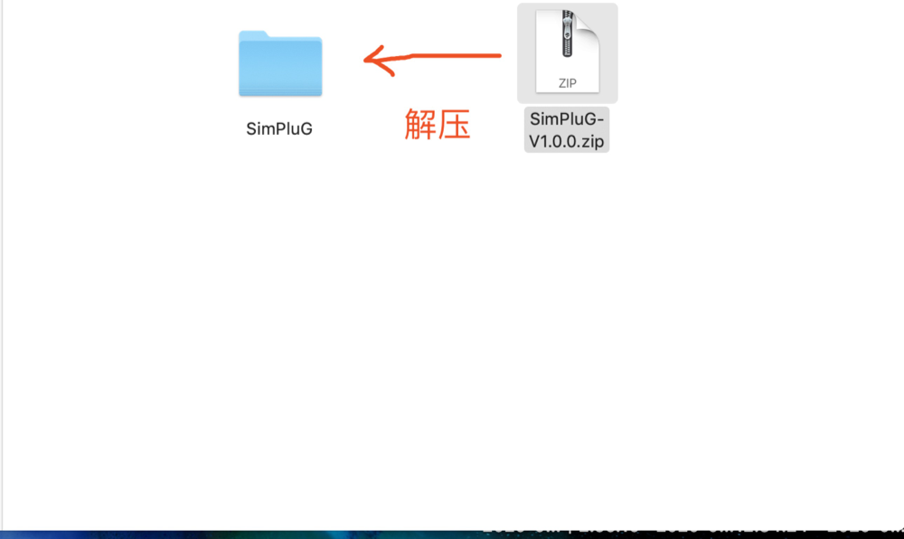
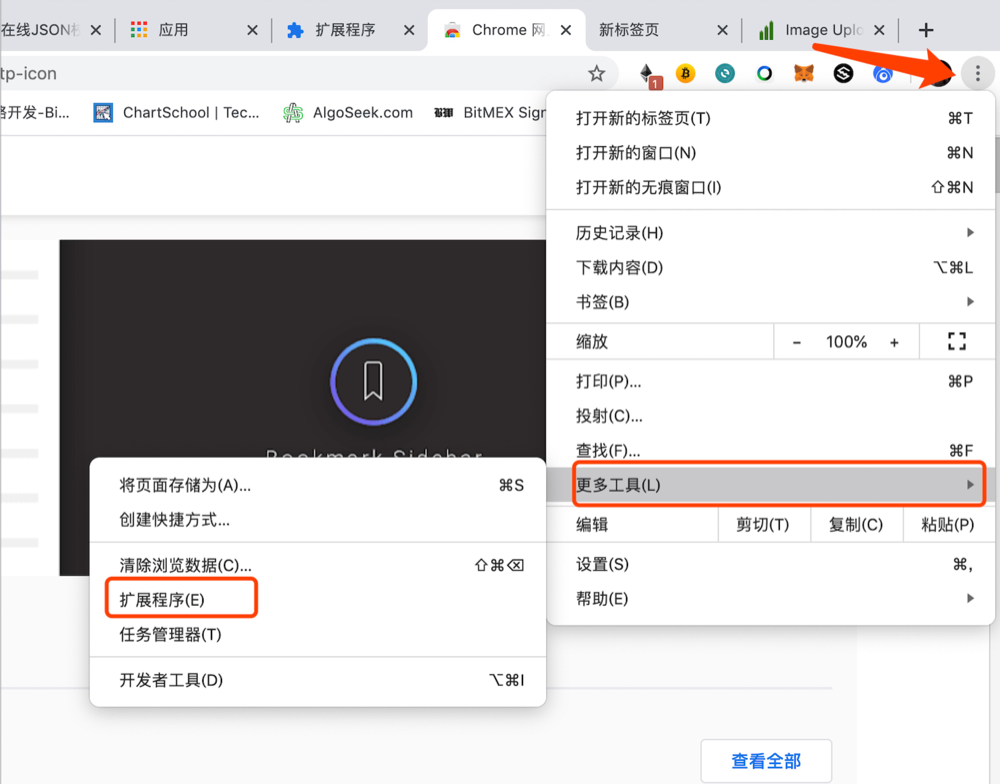
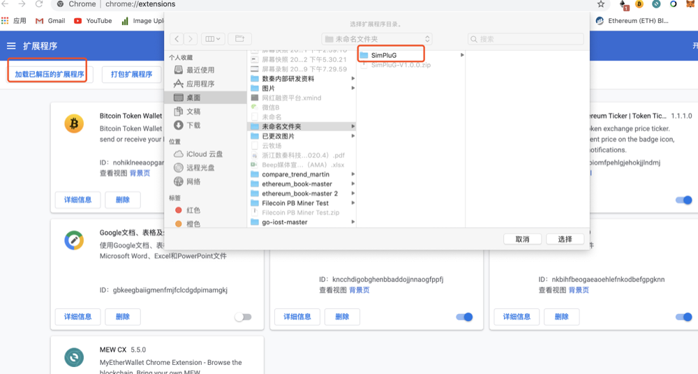
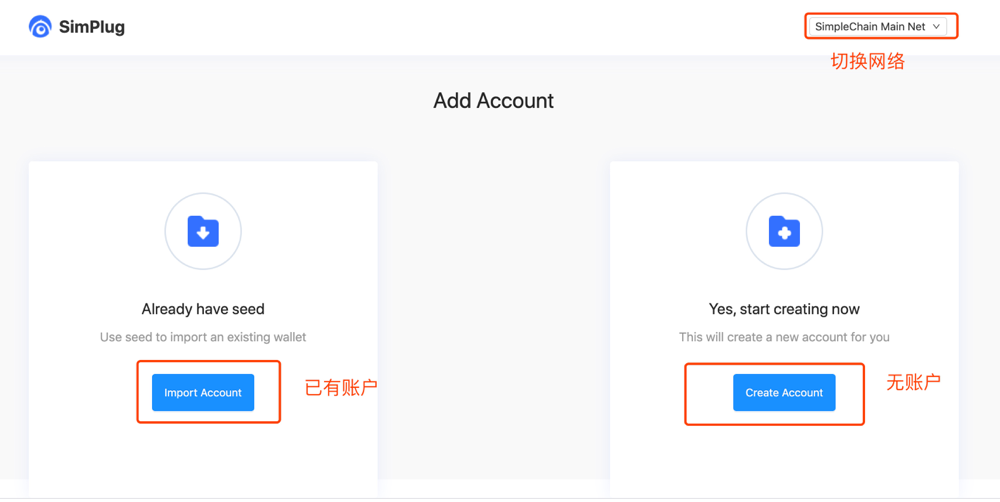

## 下载钱包

**下载**

[插件钱包下载地址](https://wallet.simplechain.com/SimPluG-V1.0.0.zip)

**解压**

## 安装钱包

1.打开google 浏览器，打开扩展程序

2.将安装包安装到扩展程序中

3.安装完以后打开钱包

4.打开钱包，选择主网或是测试网，如果已有钱包就直接导入，如果没有账户就直接创建账户。

5.创建账户，备份私钥就可以进入自己的插件钱包。

## 钱包调用方法

**前置条件**

1. 需要运行插件的应用（以下简称开发者）根据window.hasSimplug来判断插件是否可用。
2. 开发者需要在页面中放置一个id为"run_contract_btn"的按钮触发simplug的事件。
3. 开发者需要在页面中放置一个id为"run_contract_data"的隐藏input向sumpulg发送交易data。

**操作过程**

1. 用户点击或者脚本触发点击id为"run_contract_btn"的按钮。
2. 与此同时开发者需要在页面中设置id为"run_contract_data"的input的值为需要发送交易的data。
3. 插件会自动唤醒调用交易。
