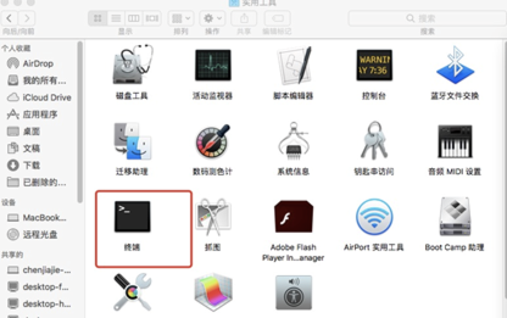

## Window版本

**注：该GPU挖矿只支持链接矿池**

`SImpool网址`：https://simpool.vip

`GPU挖矿所需要的软件下载`：http://suo.im/5E6IrE

### 矿池注册流程：

第一步：注册矿池账户（用户名最好是英文）；

第二步：进入账户设置；

第三步：在个人中心设计收款地址（不然系统没办法打币）；

**特别注意的地方：**

1. 账户名称很重要，name后面跟的一定是矿池后面的账户用户名。

### 下载GPU所需要的文件

下载地址：https://github.com/simplechain-org/gpuminer/releases（一定要下载最新版，最新版效率更高哦！最新版本是1.0.3）


 
### 解压修改文件


把压缩文件解压成文件夹。点进去，找到文件start.bat文件，用记事本编辑它：


修改完之后，双击start.bat即可链接矿池，成功后的截图：


接入矿池后即可在各个矿池官网登录自己的矿池账户查看自己收益。

### Mac版本

SimpleChain 官方GPU挖矿教程（MAC）

注：该GPU挖矿只支持链接矿池

SImpool网址：https://simpool.vip

GPU挖矿所需要的软件下载：http://suo.im/5E6IrE

### 矿池注册流程：

- 第一步：注册矿池账户（用户名最好是英文）；
- 第二步：进入账户设置；
- 第三步：在个人中心设计收款地址（不然系统没办法打币）；

**特别注意的地方**

- 账户名称很重要，name后面跟的一定是矿池后面的账户用户名。

### 下载GPU所需要的文件

下载地址：hhttp://suo.im/5E6IrE


### 解压修改文件

把压缩文件解压成文件，放到桌面：


然后打开命令行模式，找到终端、终端在实用工具里：



 
先用`cd desktop`进入桌面（默认刚刚下载的文件在桌面），然后获得操作刚刚下载文件的权限，`chmod +x gpuminer`（如果文件在桌面，负责粘贴就可以用！）：


获得权限后，输入命令启动文件：

```bash
./gpuminer –server simpool.vip:8801 –name abc(118.31.45.65:8801是矿池地址，每个矿池的地址不一样，abc是账户名称,一定填自己账户。)运行成功后：
```


 


