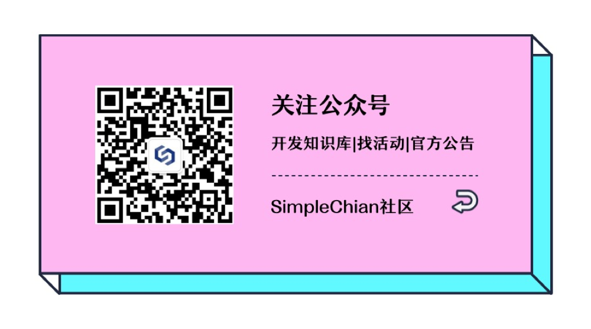
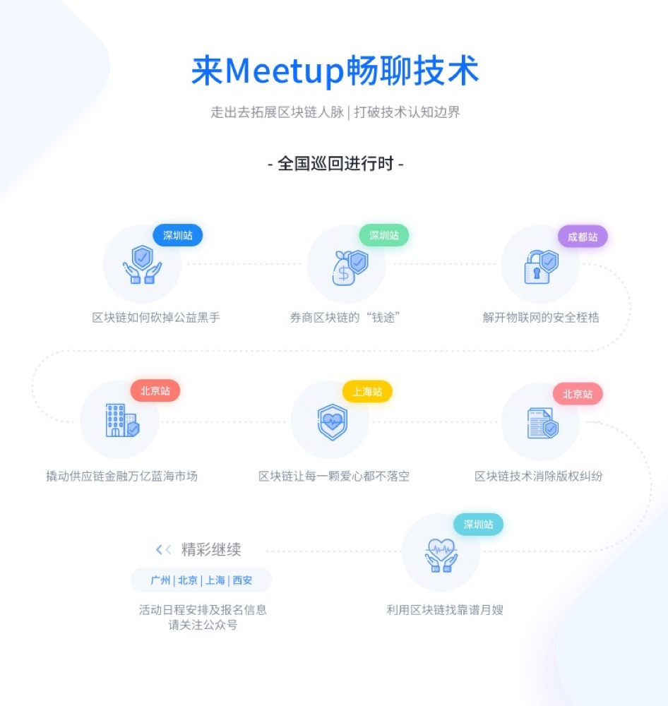
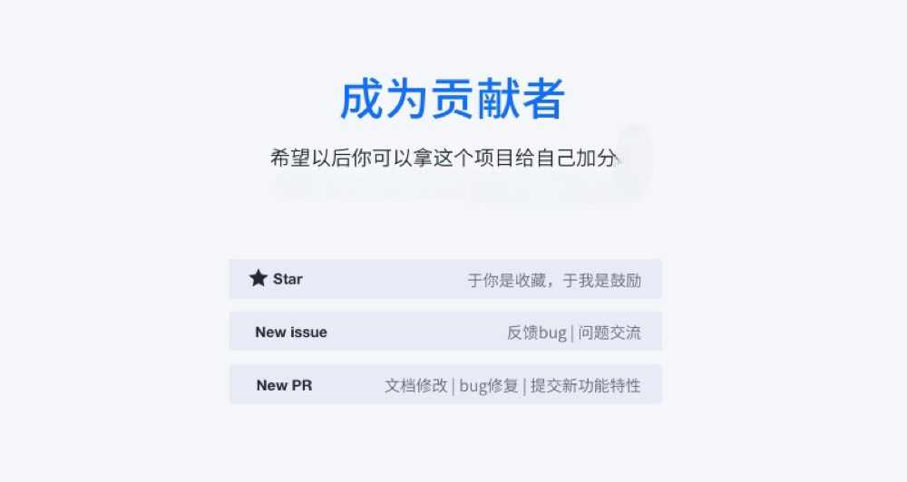

SimpleChain是一个由社区主导，对外开源的公有底层区块链平台，由SimpleChain基金会成立的开源工作组与技术社区成员写作打造。

## Simplechain资源列表

[Github主页](https://github.com/simplechain-org)

[技术文档](https://simplechainfans.github.io/sipc-docs/docs/docs_1)

[深度解析系列文章](https://www.jianshu.com/u/ef5c221114f5)

[贡献代码](https://github.com/simplechain-org/go-simplechain)

[反馈问题](https://github.com/simplechain-org/go-simplechain/issues)

[应用案例集合](https://simplechainfans.github.io/sipc-docs/docs/docs_48)

## 加入Simlechain社区

