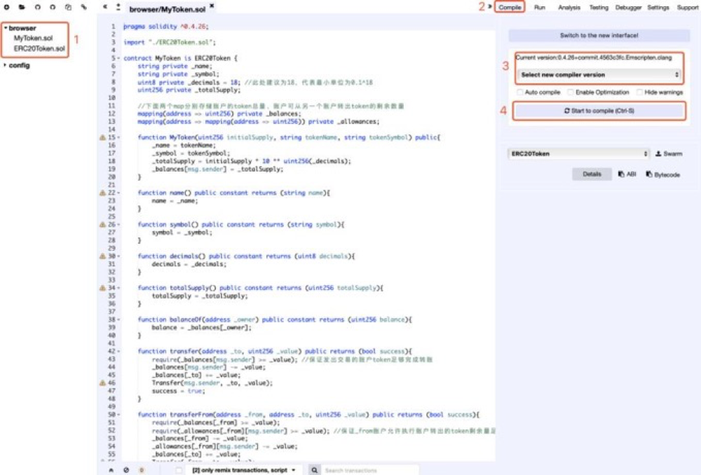
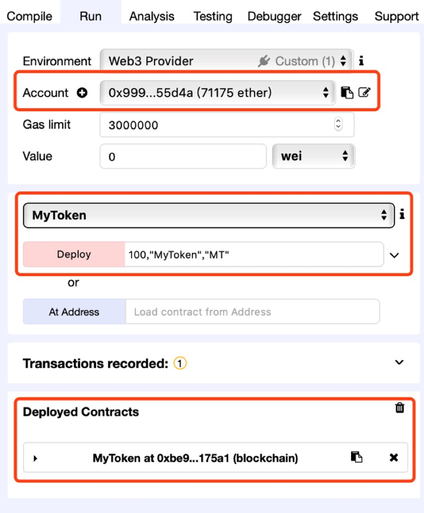
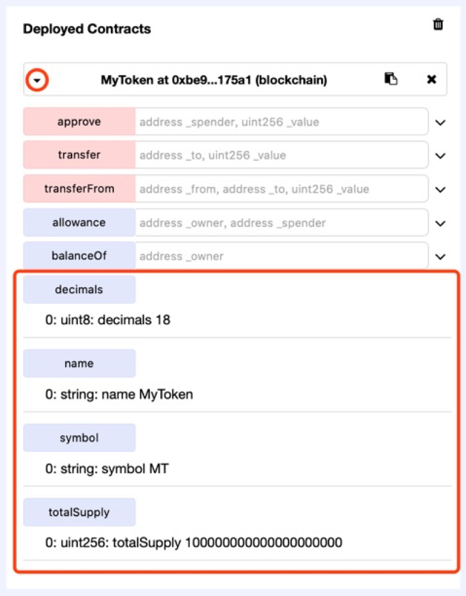

### 如何在SimpleChain上发行数字资产

**前提条件**

实现链上发币的准备工作，包括:

-  SimpleChain 的下载以及部署。 
-  启动节点。
-  创建账户。
-  确保账户解锁并有 token。

**准备工作**

1.了解 ERC20 代币标准。
 
`说明:在 SimpleChain 上实现代币需要遵循 ERC20 标准。`

    //ERC20Token.sol
    //ERC 合约标准，该标准规定在发 Token 之前，需要指定 token 的名称、标识、总量、实现合 
    //约标准函数等    
    pragma solidity ^0.4.26; 
    
    contract ERC20Token {
        //获取 token 名称
        function name() public constant returns (string name);
        //获取 token 标识
        function symbol() public constant returns (string symbol);
        //获取 token 的最小分割量
        function decimals() public constant returns (uint8 decimals);
        //获取 token 的总量
        function totalSupply() public constant returns (uint256 totalSupply);
        //获取_owner 账户当前的 token 量
        function balanceOf(address _owner) public constant returns (uint256 balance);
        //转账交易
        function transfer(address _to, uint256 _value) public returns (bool success);
        //由_from 向_to 进行转账
        function transferFrom(address _from, address _to, uint256 _value) public returns (bool success);
        //许可_spender 能从调用合约方法的账户转出总量为_value 的 token
        function approve(address _spender, uint256 _value) public returns (bool success);
        //获取_spender 可以从账户_owner 中转出 token 的剩余数量
        function allowance(address _owner, address _spender) public constant returns (uint remaining);
        //转账事件(transfer、transferFrom 会触发该事件)
        event Transfer(address indexed _from, address indexed _to, uint256 _value);
        //许可事件(approve 会触发该事件)
        event Approval(address indexed _owner, address indexed _spender, uint256 _value);
    }

2.编写符合ERC20标准的代币合约。

    //Mytoken.sol
    pragma solidity ^0.4.26;
    import "./ERC20Token.sol";
      
    contract MyToken is ERC20Token {
        string private _name;
        string private _symbol;
        uint8 private _decimals = 18; //此处建议为 18，代表最小单位为 0.1^18 
        uint256 private _totalSupply;

        //存储账户的 token 总量
        mapping(address => uint256) private _balances;
        //存储前一个address允许后一个address转出token的剩余数量 
        mapping(address => mapping(address => uint256)) private _allowances;

        function MyToken(uint256 initialSupply, string tokenName, string tokenSymbol) public{
            _name = tokenName;
            _symbol = tokenSymbol;
            _totalSupply = initialSupply * 10 ** uint256(_decimals);
            _balances[msg.sender] = _totalSupply;
       }

       function name() public constant returns (string name){ 
            name = _name;
       }
       function symbol() public constant returns (string symbol){ 
            symbol = _symbol;
       }
       function decimals() public constant returns (uint8 decimals){ 
            decimals = _decimals;
       }
       function totalSupply() public constant returns (uint256 totalSupply){ 
            totalSupply = _totalSupply;                
       }
       function balanceOf(address _owner) public constant returns (uint256 balance){ 
            balance = _balances[_owner];
       }
       function transfer(address _to, uint256 _value) public returns (bool success){ 
           require(_balances[msg.sender] >= _value); //保证发出交易的账户 token 足够完成转账
           _balances[msg.sender] -= _value; _balances[_to] += value; Transfer(msg.sender, _to, _value); success = true;
       }
       function transferFrom(address _from, address _to, uint256 _value) public returns (bool success){
           require(_balances[_from] >= _value); //保证_from 账户 token 足够完成转 账
           require(_allowances[_from][msg.sender] >= _value); //保证_from 账户允许 执行账户转出的 token 剩余量足够
           _balances[_from] -= _value; _allowances[_from][msg.sender] -= _value; _balances[_to] += _value;
           Transfer(_from, _to, _value);
           success = true;
       }
                                 }
       //许可_spender 能从调用合约方法的账户转出总量为_value 的 token
       function approve(address _spender, uint256 _value) public returns (bool success){
           _allowances[msg.sender][_spender] = _value; 
           Approval(msg.sender, _spender, _value); success = true;
       }
                  
       //获取_spender 可以从账户_owner 中转出 token 的剩余数量
       function allowance(address _owner, address _spender) public constant returns (uint256 remaining){
            remaining = _allowances[_owner][_spender]; 
        }
    }

 **合约编译**

1. 使用浏览器打开 [Remix Solidity IDE](http://remix.sipc.vip/)。
2. 将 `ERC20Token.sol` 和 `MyToken.sol` 添加到 `browser` 文件夹下。
3. 在网页右侧框选中 `Compile` 选项，选择合约编译器的版本(本文选择 0.4.26)。
4. 点击 `Start to compile` 进行编译。

**合约部署**

1. 选中 Run 选项，在 Environment 中选择 Web3 Provider。在弹出的选框中输入当前启 动的sipe节点端口。

2. 选择已解锁且有 token 的 Account 地址。
3. 选择 MyToken 合约，在 Deploy 栏中输入初始化参数:token 总量，token 名，token标识，点击Deploy。
4. 等待一分钟左右至合约部署完成，在 Deployed Contracts 栏出现合约则说明部署完成。至此发币完成。

    
**合约验证**

1. 执行合约的decimals，name，symbol，totalSupply方法查看代币是否创建成功。

2. 执行transfer方法，展开transfer方法向其他账户进行转账并使用balanceOf查询是 否转账成功。

