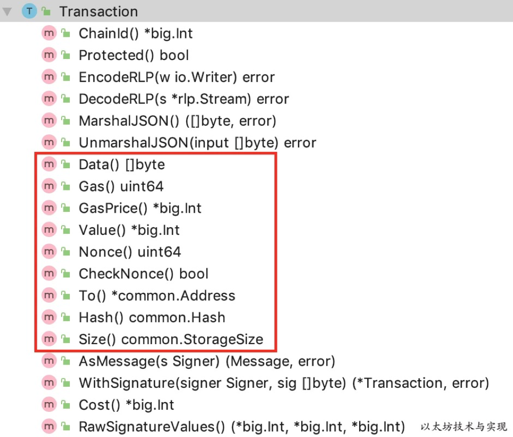

[SimpleChain](https://www.simplechain.com/)的交易(Transaction)是指由一个外部账户转移一定资产给某个账户，
或者发出一个消息指令到某个智能合约。

在[SimpleChain](https://www.simplechain.com/)网络中，交易执行属于一个事务。具有原子性、一致性、隔离性、持久性特点。

+ `原子性`： 是不可分割的最小执行单位，要么做，要么不做。
+ `一致性`： 同一笔交易执行，必然是将Simplechain账本从一个一致性状态变到另一个一致性状态。
+ `隔离性`： 交易执行途中不会受其他交易干扰。
+ `持久性`： 一旦交易提交，则对Simplechain账本的改变是永久性的。后续的操作不会对其有任何影响。

因为是事务型，因此我们需确保在执行事务前让交易符合一些设计要求。

- 交易必须唯一，能区分不同交易且同一笔交易不能重复提交到账本中。
- 交易内容不得变化，每个节点收到的交易都必须一致，交易执行时账本状态变化也是一致的。
- 交易必须被合法签名，只有已正确签名的交易才能被执行。
- 交易不能占用过多系统资源，影响其他交易执行。

对交易的设计要求，涉及软件系统的方方面面，但最基础部分还是交易数据本身。

## 交易数据结构

下图是[SimpleChain](https://www.simplechain.com/)交易数据结构，根据用途，我将其划分为四部分。


开头是一个 uint64 类型的数字，称之为随机数。用于撤销交易、防止双花和修改[SimpleChain](https://www.simplechain.com/)账户(账户数据结构)的 Nonce值。

第二部分是关于交易执行限制的设置，`gas`为愿意供[SimpleChain](https://www.simplechain.com/)虚拟机运行的燃料上限。
`gasPrice` 是愿意支付的燃料单价。`gasPrcie * gas` 则为愿意为这笔交易支付的最高手续费。

第三部分是交易发送者输入[SimpleChain](https://www.simplechain.com/)虚拟机执行此交易的初始信息： 虚拟机操作对象（接收方 To）、从交易发送方转移到操作对象的资产（Value），以及虚拟机运行时入参(input)。其中To为空时，意味着虚拟机无可操作对象，此时虚拟机将利用input内容部署一个新合约。

第四部分是交易发送方对交易的签名结果，可以利用交易内容和签名结果反向推导出签名者，即交易发送方地址。四部分内容的组合，解决了交易安全问题、实现了智能合约的互动方式以及提供了灵活可调整的交易手续费。


## 交易对象定义

具体到代码上，[SimpleChain](https://www.simplechain.com/)将交易对象定义为一个对外可访问的`Transation`对象和内嵌的对外部包不可见的`txdata` 。

> 小写的 `txdata` 是Go语言的特性。首字母小写，则相当于其他编程语言中的`private` 修饰符，表明该数据结构对外部包不可见。同样小写开头的对象字段(如 Transaction中的hash)，也表示外部包无法访问此字段。反之，首字母大写的类型、字段、方法等定义，视为`public`。

```go
// core/types/transaction.go:38
type Transaction struct {
	data txdata
	// caches
	hash atomic.Value
	size atomic.Value
	from atomic.Value
}

type txdata struct {
	AccountNonce uint64     
	Price        *big.Int  
	GasLimit     uint64     
	Recipient    *common.Address 
	Amount       *big.Int
	Payload      []byte

	// Signature values
	V *big.Int
	R *big.Int
	S *big.Int

	// This is only used when marshaling to JSON.
	Hash *common.Hash `json:"hash" rlp:"-"`
}
```

首先看私有的`txdata`结构体中定义了交易消息中所有必要内容，依次对应前面所说的交易数据结构。有三点需要特别注意。

- 一是因涉及哈希运算，因此不能随意调整字段定义顺序，非特殊处理情况下必须按要求定义字段。所以`txdata`中定义的字段，是符合Simplechain交易消息内容顺序的。

- 二是在涉及货币计算时，不能因为精度缺失引起计算不准确问题。因此在Simplechain、比特币等所有区块链设计中，货币类型均是整数，但最小值`1`所代表的币值不一样。在[SimpleChain](https://www.simplechain.com/)中一个sipc等于10的18次方Amount，当要表示100亿sipc时，Amount等于10的27次方。已远远超过Uint64所能表示的范围(0-18446744073709551615)。因此[SimpleChain](https://www.simplechain.com/)一律采用Go标准包提供的大数 `big.Int` 进行货币运算和定义货币。这里的`Price`和`Amount`均是 big.Int 指针类型。另外，关于签名的三个值也是因为数字太大，而采用 big.Int 类型。

- 三是最后的`Hash`字段，这不属于交易内容的一部分，只是为了在交易的JSON中包含交易哈希。为了防止参与哈希运算，该字段被标记为`rlp:"-"`。其次，Transaction 还定义了三个缓存项：交易哈希值(hash)、交易大小(size)和交易发送方(from)。缓存的原因是使用频次高且CPU计算量大。

在区块链中最见的是哈希运算，所有链上数据基本都要参与哈希运算。而哈希运算是CPU密集型的，因此有必要对一些哈希运算等进行缓存，降低CPU计算量。首次计算完交易哈希值后，便缓存交易哈希到hash字段上。

```go
func (tx *Transaction) Hash() common.Hash {
   if hash := tx.hash.Load(); hash != nil {
      return hash.(common.Hash)
   }
   v := rlpHash(tx)
   tx.hash.Store(v)
   return v
}
```

hash 是`atomic.Value`类型，这是Go标准包提供的原子操作对象。这样可防止并发引起多次哈希计算。首先原子加载哈希值，如果存在则返回。如果不存在，则对交易进行哈希计算(rlpHash，是[SimpleChain](https://www.simplechain.com/)的哈希算法)，将哈希结果保存并返回。

第二个缓存是交易大小(size)。交易大小是指交易信息进行RLP编码后的数据大小。代表交易网络传输大小、代表交易占区块大小、代表交易存储大小。 每笔交易进入交易池都需要检查交易大小是否超过 `32KB`。推送交易数据给其他节点时也需结合交易大小，在不超过网络消息最大限制(默认10MB)下分包推送数据。为避免重复计算开销，在第一次计算后便缓存。

```go
func (tx *Transaction) Size() common.StorageSize {
   if size := tx.size.Load(); size != nil {
      return size.(common.StorageSize)
   }
   c := writeCounter(0)
   rlp.Encode(&c, &tx.data)
   tx.size.Store(common.StorageSize(c))
   return common.StorageSize(c)
}
```

如上，执行 `rlp.Encode`获得可得到数据大小，缓存结果并返回。

> rlp 是Simplechain定义的一套区块链数据编码解码协议，而非采用常见的 gzip、json、Protobuf 编码格式。目的是为了尽可能地压缩数据，毕竟区块链数据结构中只有常见的几种数据类型，不需要复杂的协议涉及，即可满足要求。

最后一个缓存项是交易发送方(from)。交易的发送方，是根据签名反向计算过程，同样是CPU密集型运算。为了保证交易合法性，程序中到处都有涉及取交易发送方地址和校验发送方的合法性。只有正确的签名才能得到发送方地址。因此对交易发送方也进行缓存。

```go
//core/types/transaction_signing.go:72
func Sender(signer Signer, tx *Transaction) (common.Address, error) {
   if sc := tx.from.Load(); sc != nil {
      sigCache := sc.(sigCache) 
      if sigCache.signer.Equal(signer) {
         return sigCache.from, nil
      }
   }

   addr, err := signer.Sender(tx)
   if err != nil {
      return common.Address{}, err
   }
   tx.from.Store(sigCache{signer: signer, from: addr})
   return addr, nil
}
```

特殊指出是需要一个`Signer`进行解签名，同时通过`Signer`获取Sender，合法时缓存并返回。但在使用缓存内容时，还需要检查前后两个Signer是否一致，因为不一样的Signer 算法不一样，获得的交易签名者也不相同。

需要注意，上面三个缓存使用都在有一个前提条件：交易对象一旦创建，交易内容不得修改。这也是为何交易对象中单独定义在私有的txdata中，而非直接定义在 Transaction中的原因之一。如下图所示，只能通过调用交易对象方法获取交易内容，无任何途径修改一个现有交易对象内容。




## 交易对象方法介绍

交易对象 Transtion 除对外提供交易内容访问外，也定义了一些辅助方法。我们依次介绍下各个方法。

1. `ChainId()`和`Protected()`

  ```go
  func (tx *Transaction) ChainId() *big.Int {
    return deriveChainId(tx.data.V)
  }
  func (tx *Transaction) Protected() bool {
    return isProtectedV(tx.data.V)
  }
  ```

从交易签名内容`V`中提取`链ID`。用于在获取交易签名者时判断签名合法性，一旦属于受保护`Protected()`的交易，则签名信息中必须包含当前链ID，否则属于非法交易。

2. RLP接口实现方法

   ```go
   func (tx *Transaction) EncodeRLP(w io.Writer) error {
      return rlp.Encode(w, &tx.data)
   }
   func (tx *Transaction) DecodeRLP(s *rlp.Stream) error {
      _, size, _ := s.Kind()
      err := s.Decode(&tx.data)
      if err == nil {
         tx.size.Store(common.StorageSize(rlp.ListSize(size)))
      }
      return err
   }
   ```
和其他面向对象语言不同，Go语言中只要对象有实现某个接口的所有方法，则认为该对象属于某接口类型。这里Transaction 实现了rlp包中的`Encoder`和`Decoder`两个接口。

  ```go
  //rlp/encode.go:36
  type Encoder interface {
     EncodeRLP(io.Writer) error
  }
  type Decoder interface {
    DecodeRLP(*Stream) error
  }
  ```

意味在进行RLP编码解码时，将通过自定义实现的两个方法进行。RLP编码解码交易，实际是将交易内容 txdata 进行编码解码。同时在解码交易时，缓存交易大小。

3. JSON接口实现

   ```go
   func (tx *Transaction) MarshalJSON() ([]byte, error) {
      hash := tx.Hash()
      data := tx.data
      data.Hash = &hash
      return data.MarshalJSON()
   }
   func (tx *Transaction) UnmarshalJSON(input []byte) error {
      var dec txdata
      if err := dec.UnmarshalJSON(input); err != nil {
         return err
      }
      withSignature := dec.V.Sign() != 0 || dec.R.Sign() != 0 || dec.S.Sign() != 0
      if withSignature {
         var V byte
         if isProtectedV(dec.V) {
            chainID := deriveChainId(dec.V).Uint64()
            V = byte(dec.V.Uint64() - 35 - 2*chainID)
         } else {
            V = byte(dec.V.Uint64() - 27)
         }
         if !crypto.ValidateSignatureValues(V, dec.R, dec.S, false) {
            return ErrInvalidSig
         }
      }
      *tx = Transaction{data: dec}
      return nil
   }
   ```

这是实现了json标准包的编码解码方法，主要是给web3 api 调用时返回符合要求的JSON格式数据。编码时附加交易哈希，解码时还校验签名格式的正确性。下面是一个完整交易JSON格式数据示例。

   ```json
   {
   	"nonce": "0x16",
   	"gasPrice": "0x2",
   	"gas": "0x1",
   	"to": "0x0100000000000000000000000000000000000000",
   	"value": "0x0",
   	"input": "0x616263646566",
   	"v": "0x25",
   	"r": "0x3c46a1ff9d0dd2129a7f8fbc3e45256d85890d9d63919b42dac1eb8dfa443a32",
   	"s": "0x6b2be3f225ae31f7ca18efc08fa403eb73b848359a63cd9fdeb61e1b83407690",
   	"hash": "0xb848eb905affc383b4f431f8f9d3676733ea96bcae65638c0ada6e45038fb3a6"
   }
   ```

`json`里面所有数字类型的字段都是用十六进制数表示。这是为了统一所有数据格式，为大数 big.Int 服务。在web3js库中专门内置了bignumber库处理大数。


